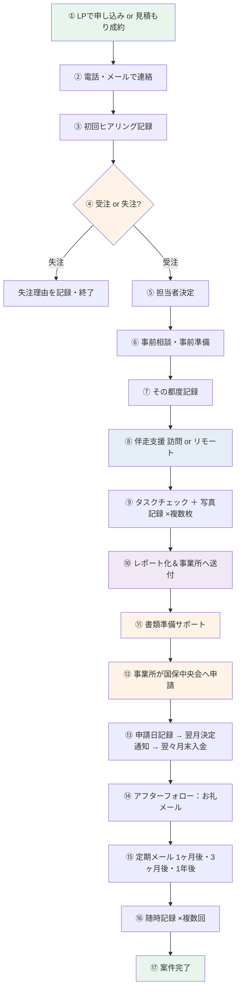
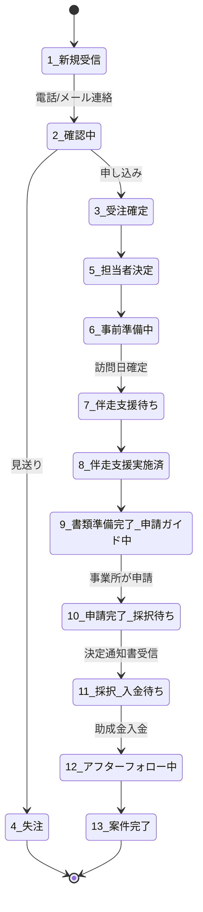
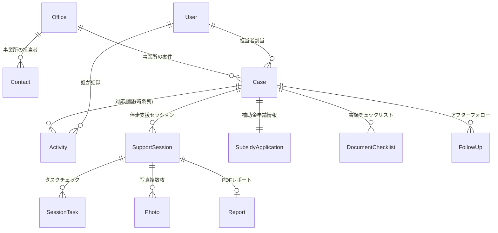
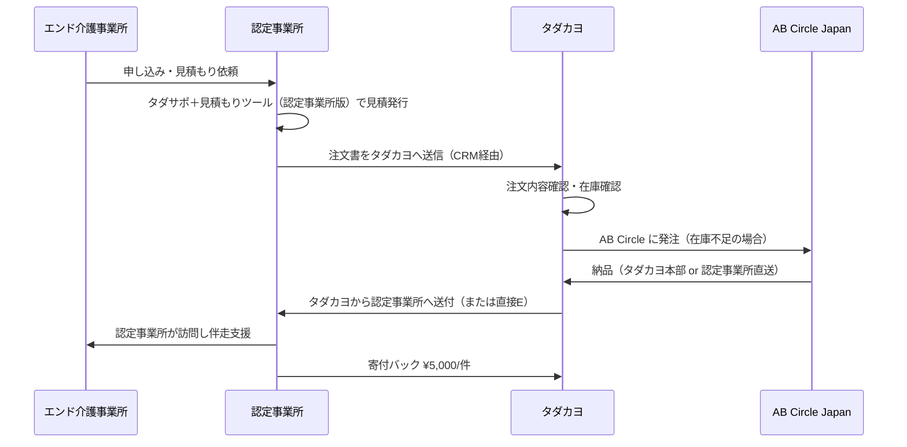

# タダカヨ介護情報基盤伴走支援 CRM 詳細仕様書

> バージョン: 0.2（設計フェーズ）
> 作成日: 2026-05-24 / 改訂: 2026-05-26（サプライチェーン機能追加）
> 作成者: 次田芳尚 ／ Claude
> 関連ドキュメント: `HANDOFF.md`, `ENGINEERING_NOTES.md`, 国保中央会「助成金申請の手引き」（令和7年12月版）

---

## 目次

0. [概要・目的](#0-概要目的)
1. [業務フロー全体図](#1-業務フロー全体図)
2. [ステータス遷移（13段階）](#2-ステータス遷移13段階)
3. [助成金申請プロセス（公式手引き調査結果）](#3-助成金申請プロセス公式手引き調査結果)
4. [ステージ別データ収集タイミング](#4-ステージ別データ収集タイミング)
5. [アラート・リマインダー設計](#5-アラートリマインダー設計)
6. [データモデル（Firestore コレクション設計）](#6-データモデルfirestore-コレクション設計)
7. [機能要件](#7-機能要件)
8. [技術スタック・アーキテクチャ](#8-技術スタックアーキテクチャ)
9. [セキュリティ・コンプライアンス](#9-セキュリティコンプライアンス)
10. [Phase 別実装計画](#10-phase-別実装計画)
11. [月額コスト試算](#11-月額コスト試算)
12. [既知の論点・未決事項](#12-既知の論点未決事項)
13. [サプライチェーン機能（発注・在庫・出荷・取次）](#13-サプライチェーン機能発注在庫出荷取次)
14. [データ収集の最適化（認定事業所側）](#14-データ収集の最適化認定事業所側)
15. [追加 Phase（サプライチェーン機能）](#15-追加-phaseサプライチェーン機能)
16. [既存ツール「イーレシート」からの移行](#16-既存ツールイーレシートからの移行)

---

## 0. 概要・目的

### 0-1. 背景

NPO法人タダカヨは「タダカヨの介護情報基盤伴走支援」（タダサポ＋シリーズ）を介護事業所に提供している。LP（kjk.tadakayo.jp）からの問い合わせ・見積もりツールでの成約を受けて、電話・メール対応 → 受注 → 担当者決定 → 事前準備 → 伴走支援（訪問/リモート） → アフターフォローという長期にわたる対応フローが発生する。

現状は Google Chat スペースに通知が流れるだけで、対応履歴やステータス管理ができていない。スタッフ複数で情報共有しながら、各事業所の進捗を把握し、補助金申請まで導く仕組みが必要。

### 0-2. 目的

- **案件のリスト化と一元管理**：LP/見積もりから受信したすべての案件を Firestore に保存
- **対応履歴の時系列管理**：電話・メール・訪問・写真記録を時系列で残し、スタッフ複数で共有
- **ステータスの可視化**：受注 → 伴走支援 → 申請 → 入金 → 完了の進捗をカンバンで把握
- **書類準備状況の追跡**：補助金申請に必要な書類のチェックリスト管理
- **申請期限の自動アラート**：令和8年3月13日に間に合わせるためのリマインダー
- **伴走支援のレポート化**：5タスクのチェック＋写真記録から自動レポート生成

### 0-3. ブランディング

- メインサービス名: **タダカヨの介護情報基盤伴走支援**
- サブブランド: **タダサポ＋**（シリーズ表記）

---

## 1. 業務フロー全体図



---

## 2. ステータス遷移（13段階）



| # | ステータス | 主なタスク | 自動アラート |
|---|---|---|---|
| 1 | 新規受信 | LP/見積もりから自動登録 | Chat速報 |
| 2 | 確認中 | 初回連絡・ヒアリング | 14日超で催促 |
| 3 | 受注確定 | 事業所番号・サービス種別の登録 | — |
| 4 | 失注 | 失注理由を記録 | — |
| 5 | 担当者決定 | スタッフ割当・訪問日調整 | — |
| 6 | 事前準備中 | 書類準備チェックリスト・ポータルアカウント取得 | 7日超で催促 |
| 7 | 伴走支援待ち | 訪問日確定 | 前日リマインダー |
| 8 | 伴走支援実施済 | 5タスク完了・写真記録 | レポート生成促す |
| 9 | 書類準備完了・申請ガイド中 | 事業所が自分で申請するための準備支援 | **3/13期限カウントダウン（30/14/3日前）** |
| 10 | 申請完了・採択待ち | 申請日記録 | 翌月：通知書確認 |
| 11 | 採択・入金待ち | 決定通知書受信 | 翌々月末：振込確認 |
| 12 | アフターフォロー中 | 1ヶ月/3ヶ月/1年定期メール | — |
| 13 | 案件完了 | 1年後の最終フォロー後 | — |

---

## 3. 助成金申請プロセス（公式手引き調査結果）

### 3-1. 出典

公益社団法人国民健康保険中央会「助成金申請の手引き」令和7年12月版
https://www.kaigo-kiban-portal.jp/assets/pdf/jyoseikin_tebiki.pdf

### 3-2. スケジュール上の重要事項

- 令和7年度 申請受付期間: **令和7年10月17日 〜 令和8年3月13日**
- 申請日 → **翌月**：審査・決定通知（国保中央会よりメール）
- 申請日 → **翌々月末**：助成金振込
- 令和8年度以降の助成金交付は**未定**
- 不備で再申請の場合、最初の申請日の**翌月以降**の受付（時間ロス大）
- 助成金は1事業所番号につき**1回のみ**申請可能

### 3-3. 必要書類の詳細要件

| 書類 | 要件 |
|---|---|
| **通帳の写し** | 預金種目（普通預金・当座預金）が表示されていること。キャッシュカード可。ネット銀行は口座詳細画面でPDF印刷可 |
| **サービス種類が確認できる資料** | 介護事業所指定通知書等（サービス種類コードまたは名称記載必須）。複数サービスは各々の書類を準備 |
| **領収書（写し）** | カードリーダーの**型名または商品名必須**。用途記載必須（カードリーダー、台数、接続サポート等経費）。「○○一式」では交付されない場合あり。PCは対象外なのでカードリーダーのみの領収書として作成 |

### 3-4. ファイル制約

- 形式: `.pdf` / `.jpg` / `.png` のいずれか
- サイズ: 20MB以下
- 通帳: 最大1ファイル
- 種類確認資料: 最大5ファイル
- 領収書: 最大5ファイル

### 3-5. ポータル申請フォームの入力項目

#### 基本情報
- 申請日（自動）
- 介護事業所番号（自動）
- 事業所名・所在地・電話番号

#### 助成金情報
- サービス種別コード（補助対象 + サービス種類コード・複数追加可）
- カードリーダー購入費用（A・税込・領収書と一致）
- マイナ資格確認アプリ対応CR確認チェック
- カードリーダー台数
- 介護情報基盤との接続サポート費用（B・税込・領収書と一致）
- 交付額自動計算：①総事業費(A+B) / ②助成限度額 / 交付額 = min(①,②)

#### 口座情報
- 銀行 or ゆうちょ
- 銀行名・銀行コード・支店名・支店コード
- 口座種別（普通/当座）
- 口座番号7桁
- 口座名義人（全角カタカナ）

#### 必要書類アップロード
- 通帳の写し
- サービス種類が確認できる資料
- 領収書

### 3-6. 助成金の対象範囲（注意点）

- **対象**：マイナ資格確認アプリに対応したカードリーダーの購入経費 + 介護情報基盤との接続サポート費用
- **対象外**：PC・タブレット・スマートフォン
- **対象外**：中古品・リース品
- マイナ資格確認アプリ対応CR公式リスト: https://iryohokenjyoho.service-now.com/csm?id=kb_article_view&sysparm_article=KB0011081

### 3-7. よくある質問の重要ポイント

- Q1: 令和8年度以降の助成金は未定 → **早期申請を促す**
- Q2: 不備修正再申請は最初の申請日の翌月以降の受付になる
- Q3: PC込みの領収書ではダメ。カードリーダーのみの領収書を作成する
- Q4: 中古品・リース品は対象外
- Q5: 予算上限到達で打ち切りリスクあり
- Q6: 介護情報基盤ポータルの利用料は無料

---

## 4. ステージ別データ収集タイミング

| ステージ | 収集情報 | 自動 or スタッフ入力 |
|---|---|---|
| ① 受信 | 事業所名 / 担当者 / 電話 / メール / 構成希望 | 自動（LP/見積もりWebhook） |
| ② 確認中 | 事業所番号 / サービス種別 / 補助金区分 / 導入希望時期 / ポータルアカウント有無 | スタッフ（ヒアリング） |
| ③ 受注確定 | 既存CR有無 / 必要書類準備状況 | スタッフ |
| ④ 担当者決定 | 担当タダカヨスタッフ / 訪問日時 | スタッフ |
| ⑤ 事前準備 | 通帳写し ✅ / 指定通知書 ✅ / マイナ対応CR購入 ✅ / 領収書 ✅ | スタッフ＋事業所提出 |
| ⑥ 伴走支援 | 5タスク実施記録 / 写真複数 / 所見 | スタッフ（現場） |
| ⑦ 書類準備完了 | 申請ガイド送付 / 書類最終確認 | スタッフ |
| ⑧ 申請完了・採択待ち | 申請日 / 申請内容 / 交付額 | スタッフ（事業所から共有を受けて記録） |
| ⑨ 採択 | 決定通知書受信日 | スタッフ |
| ⑩ 入金待ち | 振込予定日（自動算出） | 自動 |
| ⑪ 入金確認 | 振込実績日 | スタッフ |
| ⑫ アフターフォロー | 1ヶ月後・3ヶ月後・1年後の状況・トラブル有無 | 自動メール＋スタッフ |

---

## 5. アラート・リマインダー設計

### 5-1. 案件個別アラート

| トリガー | アラート内容 | 重要度 |
|---|---|---|
| 案件が「確認中」になって14日経過 | 「初回連絡が止まっています」 | 中 |
| 案件が「事前準備中」になって7日経過 | 書類準備の進捗確認 | 中 |
| 伴走支援セッション前日 | 「明日の訪問予定です」 | 中 |
| 伴走支援セッション完了 | 「申請可能になりました」通知 | 高 |
| 申請日から1ヶ月経過 | 「決定通知書届きましたか？」確認 | 高 |
| 申請日から2ヶ月経過 | 「助成金振込確認お願いします」 | 高 |
| 書類不備で再申請が必要 | 「翌月以降の受付になります」警告 | 高 |
| 振込から1ヶ月（次のお礼メール） | 1ヶ月フォロー実施 | 中 |
| 振込から3ヶ月 | 3ヶ月フォロー実施 | 中 |
| 振込から1年 | 1年フォロー実施・案件完了 | 中 |

### 5-2. 全体アラート（申請期限カウントダウン）

| 残り日数 | アラート対象 | 内容 |
|---|---|---|
| 30日前（2/11） | 未申請（ステータス 1〜9）すべての案件 | 「申請期限まで残り30日。書類は揃っていますか？」 |
| 14日前（2/27） | 未申請（ステータス 1〜9）すべての案件 | 「再申請の余裕がなくなります。早めの申請を」 |
| 3日前（3/10） | 未申請（ステータス 1〜9）すべての案件 | 「期限まで残り3日です。急ぎ対応を」 |

---

## 6. データモデル（Firestore コレクション設計）



### 6-1. コレクション一覧と主要フィールド

#### `offices`（事業所マスター）
- `corpName`: 法人名（必須）
- `officeName`: 事業所名（必須）
- `officeNumber`: 介護事業所番号（10桁）
- `address`: 住所
- `phone`: 代表電話
- `website`: ホームページURL
- `services[]`: サービス種別の配列 `[{code: "11", name: "訪問介護", subsidyCategory: "houmon"}]`

#### `contacts`（事業所側担当者）
- `officeId`
- `name`: 氏名
- `phone`: 電話
- `email`: メール
- `role`: 役職

#### `cases`（案件・中核コレクション）
- `caseNumber`: 案件番号（自動採番）
- `officeId`
- `primaryContactId`
- `source`: `lp_inquiry` / `mitsumori_quote`
- `status`: 1〜13 のステータス
- `assignedUserId`: タダカヨ側担当者UID
- `receivedAt`: 受信日時
- `orderedAt`: 受注日
- `completedAt`: 完了日
- `lostReason`: 失注理由（4_失注 時）
- `cardReaders[]`: 構成 `[{type: "BT", subsidyQty: 3, extraQty: 0}, ...]`
- `subsidyCategory`: 集約された補助金区分（houmon/kyojyu/other・合算の場合は複数）
- `expectedSubsidyAmount`: 期待される助成金額

#### `activities`（対応記録・タイムライン）
- `caseId`
- `type`: `phone_in` / `phone_out` / `email_in` / `email_out` / `memo` / `visit` / `gmail_sent`
- `occurredAt`: 日時
- `userId`: 実施者
- `subject`: 件名
- `body`: 本文・内容
- `attachmentUrls[]`: 添付ファイルURL（Cloud Storage）
- `gmailMessageId`: Gmail送信時のメッセージID

#### `supportSessions`（伴走支援セッション）
- `caseId`
- `scheduledAt`: 予定日時
- `executedAt`: 実施日時
- `mode`: `onsite` / `remote`
- `attendantUserIds[]`: 担当タダカヨスタッフUIDs
- `participantContactIds[]`: 参加した事業所側担当者
- `notes`: 所見・メモ
- `status`: `planned` / `completed` / `cancelled`

#### `sessionTasks`（伴走支援タスクチェック）
- `sessionId`
- `taskKey`: `card_reader_setup` / `myna_app_setup` / `dx_cert_install` / `portal_account_setup` / `careplan_data_link`
- `taskName`: 表示名
- `completed`: 実施有無
- `completedAt`: 実施時刻
- `photoIds[]`: 関連写真ID
- `memo`: メモ

#### `photos`（写真）
- `url`: Cloud Storage URL
- `thumbnailUrl`: サムネイル
- `uploadedByUserId`
- `uploadedAt`
- `sessionId`
- `taskId`
- `caption`: キャプション

#### `reports`（伴走支援レポート）
- `sessionId`
- `pdfUrl`: 生成PDF URL
- `generatedAt`
- `sentToOfficeAt`: 事業所へ送付した日時
- `gmailMessageId`

#### `documentChecklists`（書類準備チェックリスト）
- `caseId`
- `bankbookReady`: 通帳の写し（boolean）/ `attachmentUrls[]`
- `serviceConfirmReady`: サービス種類確認資料 / `attachmentUrls[]`
- `receiptReady`: 領収書 / `attachmentUrls[]`
- `mynaAppCompatibleConfirmed`: マイナ対応CR確認済（boolean）
- `bankAccountInfo`: 振込口座情報（事業所側）
  - `bankType`: `bank` / `yucho`
  - `bankName` / `bankCode` / `branchName` / `branchCode`（銀行の場合）
  - `symbolNumber` / `accountNumber`（ゆうちょの場合）
  - `accountType`: `普通` / `当座`
  - `accountNumber`: 7桁
  - `accountHolder`: 全角カナ
- `portalAccountAcquired`: ポータルアカウント取得済
- `portalAccountAcquiredAt`

#### `subsidyApplications`（補助金申請情報）
- `caseId`
- `status`: 申請ステータス（7段階：準備中/書類完了/申請済/採択/不採択/入金待ち/入金済）
- `applicationDate`: 申請日（事業所から共有を受けて記録）
- `applicationContent`:
  - `cardReaderCost`: A（カードリーダー購入費用・税込）
  - `supportCost`: B（接続サポート費用・税込）
  - `totalCost`: A+B
  - `subsidyLimit`: 助成限度額
  - `grantAmount`: 交付額（min(totalCost, subsidyLimit)）
- `decisionReceivedAt`: 決定通知書受信日
- `expectedDepositDate`: 振込予定日（自動算出）
- `actualDepositDate`: 振込実績日
- `rejectionReason`: 不採択時の理由

#### `followUps`（アフターフォロー）
- `caseId`
- `type`: `thanks` / `1month` / `3month` / `1year` / `ad_hoc`
- `scheduledAt`
- `executedAt`
- `mailDraft`: ドラフト本文（送信前）
- `mailBody`: 送信本文
- `gmailMessageId`

#### `users`（タダカヨスタッフ）
- `uid`: Firebase Auth UID
- `email`: @tadakayo.jp
- `name`: 氏名
- `role`: `admin` / `staff`（Phase 1は全員admin同一権限）
- `notificationPreferences`: 通知設定

#### `emailLogs`（送信メールログ）
- `caseId`
- `sentAt`
- `to`
- `subject`
- `body`
- `templateId`
- `gmailMessageId`
- `sentByUserId`

#### `subsidyInfoSnapshot`（補助金情報スナップショット）
- `fetchedAt`
- `subsidyCategories`: 区分別上限・対象サービス
- `applicationPeriod`: 申請期間
- `changeDetectionHash`: 変更検知用ハッシュ
- `lastConfirmedByUserId`
- `lastConfirmedAt`

#### `auditLogs`（監査ログ・Pマーク準拠）
- `userId`
- `action`: 操作種別
- `targetCollection` / `targetDocId`
- `occurredAt`
- `ipAddress`

---

## 7. 機能要件

### 7-1. 案件管理（基本）
- 案件一覧（テーブル・カンバン切替）
- 案件詳細ページ・タイムライン
- ステータス変更（カンバンドラッグ可）
- 担当者割当
- フィルタ・検索

### 7-2. 対応記録
- 電話・メール・メモ・訪問予約の追加
- タイムライン表示（時系列）
- 写真添付（Cloud Storage）

### 7-3. 書類チェックリスト
- 通帳・指定通知書・領収書・マイナ対応CR確認の4項目
- ファイルアップロード（Cloud Storage）
- 申請ガイド送付ボタン

### 7-4. 申請ステータス追跡
- 7段階ステータス
- 申請日・決定通知書受信日・振込予定日・振込実績日の記録
- 振込予定日の自動算出（申請月の翌々月末）

### 7-5. 伴走支援セッション
- セッション作成（訪問日時・形式・担当者）
- 5タスクチェックリスト＋カスタム
- 写真複数枚アップロード（タスクごとに紐づけ）
- スマホレスポンシブUI

### 7-6. レポート生成
- 伴走支援レポートPDF自動生成（写真サムネ・チェックリスト・所見）
- 事業所へメール送付

### 7-7. メール送信（Gmail API）
- テンプレート選択式（7種類想定）
  - 受注確認 / 事前打ち合わせ日程調整 / 事前準備のお願い / お礼 / 1ヶ月フォロー / 3ヶ月フォロー / 1年フォロー
- 送信プレビュー → 送信ボタン
- 送信履歴をタイムラインに記録

### 7-8. アフターフォロー自動化
- Cloud Scheduler で定期実行
- ドラフトメール作成 → スタッフ承認 → 送信
- フォロー記録の追記UI

### 7-9. 補助金情報ダッシュボード
- 助成金区分・上限額・対象サービス35種類の表示
- 申請期間・受付状況
- 申請ポータルへの直リンク
- 最新の厚労省通知
- 「最終確認日」表示・手動更新ボタン（半自動更新）

### 7-10. 全体アラート・リマインダー
- 申請期限カウントダウン（30/14/3日前）
- 案件ステージ滞留アラート
- 振込予定日リマインダー
- スタッフ通知（Google Chat スペースへ）

### 7-11. 集計・レポート
- 月次ダッシュボード（受信数・受注率・完了数）
- 担当者別実績
- パイプラインファネル分析

### 7-12. CSV出力
- 案件一覧・対応履歴・申請情報を CSV エクスポート（バックアップ・他ツール移行用）

---

## 8. 技術スタック・アーキテクチャ

```mermaid
flowchart LR
    LP[LP問い合わせフォーム] -->|Webhook| CF1[Cloud Functions: webhook]
    M[見積もりツール] -->|Webhook| CF1
    CF1 --> FS[(Firestore)]
    FS <--> ADMIN[/admin 管理画面]
    ADMIN <--> AUTH[Firebase Auth]
    ADMIN --> CF2[Cloud Functions: Gmail送信]
    CF2 --> GMAIL[Gmail API]
    ADMIN --> CS[Cloud Storage 写真/PDF]
    CF1 --> CHAT[Google Chat Webhook]
    SCH[Cloud Scheduler] -->|定期実行| CF3[Cloud Functions: スケジュール]
    CF3 --> FS
    CF3 --> GMAIL
    CF3 --> CHAT

    style FS fill:#e8f5ec
    style ADMIN fill:#e5edf5
    style CS fill:#fef3e6
```

| 層 | 技術 |
|---|---|
| ホスティング | Firebase Hosting（既存 kjk-tadakayo プロジェクト） |
| 管理画面 | `/admin/` 配下に追加・Vanilla JS + Firebase SDK v10 CDN |
| データベース | Cloud Firestore |
| バックエンドAPI | Cloud Functions for Firebase (Node.js 20) |
| ファイル保管 | Cloud Storage for Firebase |
| 認証 | Firebase Authentication (Google) |
| 定期実行 | Cloud Scheduler + Pub/Sub |
| メール送信 | Gmail API（OAuth・タダカヨアカウントから送信） |
| PDF生成 | Cloud Functions + Puppeteer or marked |
| スタッフ通知 | Google Chat Webhook（既存スペース AAQAkcdopcA 拡張） |

---

## 9. セキュリティ・コンプライアンス

### 9-1. 認証

- Firebase Authentication（Google プロバイダ）
- メールドメイン制限: `@tadakayo.jp` のみ許可
- セッション期限: 24時間

### 9-2. Firestore セキュリティルール

```javascript
rules_version = '2';
service cloud.firestore {
  match /databases/{database}/documents {
    function isAuthenticated() {
      return request.auth != null;
    }
    function isTadakayoStaff() {
      return isAuthenticated() && request.auth.token.email.matches('.*@tadakayo[.]jp$');
    }

    match /{document=**} {
      allow read, write: if isTadakayoStaff();
    }

    // Webhook受信用のCloud Functions経由は service account で書き込み（ルールバイパス）
    // /admin からの直接書き込みはタダカヨスタッフのみ
  }
}
```

### 9-3. Cloud Storage セキュリティルール

```javascript
rules_version = '2';
service firebase.storage {
  match /b/{bucket}/o {
    match /sessions/{sessionId}/photos/{photoId} {
      allow read, write: if request.auth != null && request.auth.token.email.matches('.*@tadakayo[.]jp$');
    }
    match /reports/{reportId} {
      allow read, write: if request.auth != null && request.auth.token.email.matches('.*@tadakayo[.]jp$');
    }
  }
}
```

### 9-4. Webhook エンドポイントの保護

- 既存LPからのWebhookは Cloud Functions 内で `secret` 検証（事前共有秘密鍵）
- 秘密鍵は Google Secret Manager で管理

### 9-5. Pマーク準拠（タダカヨ規程対応）

- ✅ 個人情報を含むデータは Firestore + Cloud Storage の private 領域のみ保管
- ✅ Cloud Functions 内処理ログから個人情報マスキング
- ✅ 監査ログ：`auditLogs` コレクションに全アクセス記録
- ✅ データ削除リクエスト対応UI（30日内の論理削除→物理削除）
- ✅ 委託先 = Google Cloud Platform（タダカヨ GCP プロジェクト内）
- ✅ ログ保管: Cloud Logging（30日間）

### 9-6. Gmail API トークン管理

- OAuth 2.0 のリフレッシュトークンは Secret Manager 管理
- クライアントJSには絶対に埋め込まない
- スコープ: `https://www.googleapis.com/auth/gmail.send` のみ

---

## 10. Phase 別実装計画

### Phase 1: MVP — 受信＋案件管理＋書類チェック＋申請追跡（1日）

含めるもの：
- `/admin` ルート作成、Firebase Auth (Google・@tadakayo.jp限定)
- Firestore セキュリティルール
- Cloud Functions: LP/見積もりツールWebhook受信 → Firestore保存
- 案件一覧ページ（テーブル形式）
- 案件詳細ページ
- ステータス変更（13段階）
- 対応記録の追加（電話・メール・メモ）
- タイムライン表示
- 担当者割当
- **書類チェックリスト**（通帳・指定通知書・領収書・マイナ対応CR確認）
- **申請ステータス追跡**（申請日・決定日・振込日）
- 既存 Google Chat Webhook通知は並行維持

### Phase 2: ステータスカンバン＋全体アラート（半日）

- カンバンUI（ドラッグ&ドロップでステータス変更）
- 申請期限カウントダウン（30/14/3日前アラート）
- 案件ステージ滞留アラート（14日/7日）

### Phase 3: Gmail API メール送信＋テンプレート（1日）

- OAuth 認証（タダカヨアカウントの Gmail スコープ）
- 7種類のメールテンプレート
- 送信プレビュー → 送信ボタン
- 送信履歴をタイムラインに記録（emailLogs）

### Phase 4: 伴走支援セッション＋写真（1日）

- セッション作成UI（訪問日時・形式・担当者）
- 5項目タスクチェックリスト＋カスタム
- 写真アップロード（Cloud Storage）→ タスクごとに紐づけ
- スマホレスポンシブUI（現場で記録できる）

### Phase 5: 伴走支援レポートPDF生成（半日）

- Cloud Functions: PDF生成（事業所情報・チェックリスト・写真サムネ・所見）
- 事業所へメール送付（Phase 3利用）
- タダカヨ内 Cloud Storage に保管

### Phase 6: アフターフォロー自動化（半日）

- Cloud Scheduler で定期実行（1ヶ月/3ヶ月/1年）
- ドラフトメール作成 → スタッフ承認後送信
- フォロー記録の追記UI

### Phase 7: 補助金情報ダッシュボード＋集計レポート（半日）

- 補助金情報ダッシュボード（半自動更新）
- 月次受信数・受注率・完了数
- 担当者別実績
- パイプラインファネル分析

### Phase 8: CSV出力＋データ削除（半日）

- 案件CSVエクスポート
- データ削除リクエスト対応UI

**合計工数: 5〜6日（複数セッションに分割実装）**

---

## 11. 月額コスト試算

| 項目 | 想定 | 月額 |
|---|---|---|
| Firebase Hosting | 静的サイト追加 | 無料 |
| Firestore | 月数千読み書き（案件数100/月程度） | 無料枠内 |
| Cloud Functions | 月数千実行 | 無料枠内 |
| Cloud Storage | 写真・PDF 10GB未満 | 無料枠内 |
| Cloud Scheduler | 3 jobs まで | 無料 |
| Gmail API | 1日250件まで無料 | 無料 |
| **合計** | | **¥0〜数百** |

---

## 12. 既知の論点・未決事項

### 12-1. 着手前の確認事項

| # | 項目 | 担当 | 期日 |
|---|---|---|---|
| 1 | Firebase Console で Firestore を有効化 | 次田さん | 着手前 |
| 2 | Firebase Auth で Google プロバイダ有効化 | 次田さん | 着手前 |
| 3 | Cloud Storage を有効化 | 次田さん | 着手前 |
| 4 | Gmail API OAuth クライアント作成 | 次田さん | Phase 3着手前 |
| 5 | Pマーク規程との照合 | 次田さん | 着手前 |
| 6 | スタッフ初期メンバーリスト確定 | 次田さん | Phase 1着手後でも可 |

### 12-2. Phase 別の決定事項

| 項目 | 状態 |
|---|---|
| 申請関与レベル | 「資料サポートのみ」（事業所が自分で申請） |
| 申請期限アラート | 30/14/3日前の3段階 |
| スタッフ権限 | 全員同一（admin） |
| メール送信方式 | Gmail API |
| スタッフ共有 | Google Chat スペース（既存）拡張 |
| 5項目タスク | 確定（カードリーダー接続/マイナアプリ/介護DX証明書/ポータルアカウント/ケアプランデータ連携） |
| 補助金情報更新 | 半自動（スタッフ承認） |
| 申請ステータス | 7段階 |
| 案件ステータス | 13段階 |
| 情報ソース | 介護情報基盤＋厚労省介護保険最新情報 |

### 12-3. 未決事項（Phase 着手中に詰める）

- メールテンプレート初期文面（7種類）
- 「お礼メール」「定期メール」の差出人名（タダカヨ事務局 / 担当者個人 / 案件ごとに切替）
- 写真の保存期間（無期限 / 1年 / 案件完了+N日）
- 失注理由のカテゴリ（料金/時期/他社/不要/その他 等）
- スタッフ初期メンバーリスト

### 12-4. 将来の拡張候補（Phase 9 以降）

- 認定事業所チャネルの案件管理（パートナー事業所からの紹介案件を区別）
- 寄付バック管理（認定事業所→タダカヨ ¥5,000/件）
- LINE・Slack通知の追加
- 介護記録ソフト連携（カイポケ等）

---

## 13. サプライチェーン機能（発注・在庫・出荷・取次）

### 13-0. 背景・経緯

現状（2026-05-25時点）の運用：
- カードリーダーの発注は「イーレシート」というSaaSで発注書PDFを作成し、AB Circle Japan に送付
- 発注番号は連番（NO.42、NO.43 ...）で人手管理
- 単価は ¥7,050（特価対応・卸 ¥8,000 より安い・100台規模で交渉済）
- 送料は地域別（北海道 ¥1,500 / 滋賀県 ¥1,100 等）
- 100台未満の注文は別途輸送費が発生
- 納品先は複数：タダカヨ本部 / パートナー企業 / 個人住所 / 介護事業所直送 など

### 13-1. 機能スコープ

**【自社運用】**
1. 発注書作成（タダカヨ → AB Circle Japan）+ PDF出力
2. 品目マスタ・送料マスタ・納品場所マスタ
3. 在庫管理（場所別 × 品目別）
4. 入庫処理（AB Circle から納品受領）
5. 出荷処理 + 送付状PDF（タダカヨ → 介護事業所）

**【認定事業所向け】**
6. 認定事業所からの発注受付ツール（B2Bポータル）
7. 受注 → AB Circle へ自動転送発注のドラフト生成
8. 認定事業所への請求・送付状管理

### 13-2. 発注書（タダカヨ → AB Circle）の設計

#### フォーマット（既存の「イーレシート」スタイルを踏襲）

```
                                発 注 書

[宛先]                                              NO.    {連番}
AB Circle Japan 株式会社 御中                       発行日 YYYY-MM-DD

                                                  [発注者]
                                                  NPO法人タダカヨ
下記の通り発注申し上げます。                          事務所所在地：東京都大田区大森中二丁目1番20-1001号
                                                  理事長：佐藤拡史
TOTAL  ¥###,###
                                                  [送付先]
                                                  〒XXX-XXXX
                                                  ○○県○○市○○ 株式会社○○
                                                  △△ 様

| 品名                                 | 数量 | 単価     | 金額       |
|------------------------------------|------|----------|------------|
| 介護情報基盤 汎用カードリーダ           | 30個 | ¥7,050   | ¥211,500   |
| CIR415A-01（特価対応）                |      |          |            |
| 送料（地域）                           |   1 | ¥1,500   | ¥1,500     |
|                                    |      |          |            |
|                                    |      |  小計    | ¥213,000   |
|                                    |      |  消費税10%| ¥21,300    |
|                                    |      |  合計    | ¥234,300   |

※100台未満のご注文の場合、別途輸送費を申し受けます。

                                                  [署名・印影]
                                                  NPO法人タダカヨ
                                                  次田芳尚 ㊞
```

#### 入力項目

- **基本情報**: 発行日（自動）/ 発注番号（連番自動）/ TOTAL（自動計算）
- **送付先**: 納品場所マスタから選択 or 新規入力
  - 郵便番号 / 住所 / 法人名 / 担当者
- **明細（複数行）**: 品目 / 数量 / 単価（マスタから自動）/ 金額（自動）
- **送料**: 地域マスタから自動選択（北海道/関東/関西/...）
- **消費税**: 10% 自動計算
- **特記事項**: 「※100台未満〜」のテンプレ + 自由入力

#### 入力支援・自動化

- 品目選択 → 単価自動入力（数量帯別単価あり）
- 数量×単価 = 金額 自動計算
- 送付先選択 → 地域から送料自動算出
- 100台未満の場合は「別途輸送費案内」を自動表示
- 連番は前回の +1（年度跨ぎは要相談）

#### PDF生成
- 「イーレシート」風レイアウトを再現（A4縦・モノクロ印刷可）
- 電子印鑑挿入（オプション・設定で ON/OFF）
- ファイル名: `発注書_{NO}_{発行日}_AB Circle様.pdf`

### 13-3. 品目マスタ（`products` コレクション）

| フィールド | 型 | 例 |
|---|---|---|
| `id` | string | `cir415a-01` |
| `name` | string | `介護情報基盤 汎用カードリーダ CIR415A-01（特価対応）` |
| `displayName` | string | `CIR415A（Bluetooth）` |
| `vendorId` | string | AB Circle Japan のID |
| `unitPriceTiers[]` | array | 数量帯別単価 `[{minQty: 100, unitPrice: 7050}, {minQty: 30, unitPrice: 7050}, {minQty: 1, unitPrice: 8000}]` |
| `taxRate` | number | 0.10 |
| `description` | string | マイナ資格確認アプリ対応カードリーダー |
| `imageUrl` | string | Cloud Storage URL |
| `isActive` | boolean | true |

### 13-4. 送料マスタ（`shippingRates` コレクション）

| フィールド | 例 |
|---|---|
| `region` | `北海道` / `東北` / `関東` / `中部` / `関西` / `中国・四国` / `九州・沖縄` |
| `pref` | 都道府県（任意・必要なら細分化） |
| `vendorId` | AB Circle Japan |
| `costPerShipment` | ¥1,500（北海道） / ¥1,100（滋賀県） / etc. |
| `condition` | `100台未満は別途見積もり` 等 |

### 13-5. 納品場所マスタ（`shippingAddresses` コレクション）

| フィールド | 例 |
|---|---|
| `id` | string |
| `nickname` | `タダカヨ本部` / `札幌・株式会社279` / `滋賀・藤田副理事長` |
| `category` | `tadakayo_office` / `partner` / `personal` / `partner_office` / `direct_to_office` |
| `zipCode` | `063-0836` |
| `address` | `北海道札幌市西区発寒16条12丁目1-20` |
| `companyName` | `株式会社279` |
| `contactName` | `次田芳尚` |
| `contactPhone` | |
| `contactEmail` | |
| `region` | `北海道`（送料計算用） |
| `notes` | 特記事項 |
| `isActive` | boolean |

### 13-6. 仕入先マスタ（`vendors` コレクション）

| フィールド | 例 |
|---|---|
| `id` | `ab-circle-japan` |
| `name` | `AB Circle Japan 株式会社` |
| `address` | 仕入先住所 |
| `contactName` | 担当者 |
| `email` | |
| `tradingTerms` | `100台未満は別途輸送費` 等 |
| `bankAccount` | 振込先（必要なら） |

### 13-7. 発注書（`purchaseOrders` コレクション）

| フィールド | 例 |
|---|---|
| `orderNo` | `43` （連番） |
| `issuedAt` | `2026-05-25` |
| `vendorId` | `ab-circle-japan` |
| `shippingAddressId` | 納品場所マスタ参照 |
| `items[]` | `[{productId, qty, unitPrice, amount}, ...]` |
| `shippingCost` | ¥1,500（自動算出） |
| `subtotal` | ¥213,000 |
| `taxAmount` | ¥21,300 |
| `total` | ¥234,300 |
| `notes` | 特記事項 |
| `pdfUrl` | 生成PDF URL |
| `status` | `draft` / `issued` / `delivered` / `cancelled` |
| `issuedByUserId` | |
| `caseIds[]` | 関連する案件ID（複数可・在庫補充発注など案件無しもあり） |

### 13-8. 在庫管理（`inventory` + `inventoryMovements`）

#### `inventory`（現在地別の在庫数）

| フィールド | 例 |
|---|---|
| `locationId` | 納品場所マスタID（タダカヨ本部・株式会社279・etc.） |
| `productId` | 品目ID |
| `quantity` | 30（現在の在庫数） |
| `safetyStock` | 10（安全在庫数。下回るとアラート） |
| `lastUpdatedAt` | |

#### `inventoryMovements`（入出庫履歴・台帳）

| フィールド | 例 |
|---|---|
| `occurredAt` | |
| `type` | `inbound`（入庫）/ `outbound`（出庫）/ `transfer`（場所間移動）/ `adjust`（棚卸調整） |
| `productId` | |
| `quantity` | +30（入庫）/ -3（出庫） |
| `fromLocationId` | 出庫元（移動の場合） |
| `toLocationId` | 入庫先 |
| `relatedPurchaseOrderId` | 入庫元の発注書ID |
| `relatedShipmentId` | 出庫先の出荷ID |
| `relatedCaseId` | 関連案件ID |
| `notes` | |
| `userId` | 操作者 |

### 13-9. 出荷・送付状（`shipments` コレクション）

#### 送付状フォーマット（タダカヨ → 介護事業所）

```
                              送 付 状

                                                  YYYY-MM-DD
[宛先]
○○県○○市○○ 1-2-3
社会福祉法人○○ △△苑
○○ 様

                                                  [送付元]
                                                  NPO法人タダカヨ
                                                  〒143-0014 東京都大田区大森中2-1-20-1001
                                                  担当：次田芳尚
                                                  TEL: 050-6872-9884

拝啓 平素は格別のお引き立てを賜り、誠にありがとうございます。
このたびは「タダカヨの介護情報基盤伴走支援」をご利用いただき、
誠にありがとうございます。下記の通り、機器をお送りいたします。

| 品名                                 | 数量 |
|------------------------------------|------|
| CIR415A（Bluetoothカードリーダー）    | 3台  |

【ご注意事項】
・本機器は介護情報基盤の利用のみにご使用ください
・破損・不具合の際は同梱の連絡先にお知らせください
・伴走支援の訪問日は別途ご連絡いたします

[同梱物]
・カードリーダー本体 ×N
・取扱説明書
・「業者ではない」ご案内文書
・伴走支援スケジュール案内

ご不明な点がございましたら、お気軽にお問い合わせください。

                                                  敬具
```

#### `shipments` フィールド

| フィールド | 例 |
|---|---|
| `shipmentNo` | 連番 |
| `issuedAt` | |
| `caseId` | 関連案件 |
| `fromLocationId` | 出荷元（タダカヨ本部等） |
| `toAddress` | 事業所住所（caseから引き継ぎ） |
| `items[]` | `[{productId, qty}, ...]` |
| `enclosedItems[]` | 同梱物（取説・お便り 等） |
| `trackingNumber` | 配送業者の追跡番号 |
| `carrier` | `ヤマト運輸` / `ゆうパック` / `佐川急便` 等 |
| `pdfUrl` | 送付状PDF |
| `status` | `draft` / `shipped` / `delivered` |
| `shippedAt` | |
| `deliveredAt` | |

### 13-10. 認定事業所チャネル（取次スキーム）

#### スキーム



#### 認定事業所が使うツールの構成

- **B2Bポータル**: https://kjk.tadakayo.jp/partner/ （認定事業所アカウントでログイン）
- **機能**:
  - エンド事業所からの問い合わせ・見積もり依頼の管理（認定事業所側のCRM）
  - 認定事業所が独自に見積書を発行（タダカヨCRMと同じレイアウト）
  - **タダカヨへの発注書作成**：機種・数量・送付先を選択 → タダカヨへ送信
  - 自社の在庫管理（タダカヨから受領した在庫を管理）
  - エンド事業所への送付状作成
  - 伴走支援セッション記録（認定事業所スタッフが現場で記録）
  - 寄付バックの月次レポート

#### 認定事業所から取得すべきデータ（タダカヨベスト）

タダカヨが受注する際に必要な情報の整理：

| 項目 | 内容 | 必須/任意 |
|---|---|---|
| 認定事業所ID | アカウント識別 | 必須 |
| 担当者名・電話・メール | 連絡先 | 必須 |
| 注文番号 | 認定事業所側の管理番号 | 必須 |
| 機種・数量 | CIR415A × N / CIR315A × N | 必須 |
| 送付先 | (A)認定事業所本社 / (B)介護事業所直送 / (C)指定先 | 必須 |
| 送付先住所 | (B/C の場合) | 条件付き必須 |
| 希望納期 | YYYY-MM-DD | 必須 |
| 介護事業所情報 | (B/C の場合) 法人名・事業所名・補助金区分 | 条件付き必須 |
| 助成金申請対象か | 補助金区分が適用される受注かどうか | 必須 |
| 認定事業所→エンド事業所の販売価格 | 取次手数料の透明性 | 任意（推奨） |
| 寄付バック予定額 | デフォルト¥5,000 | 自動 |
| 補足メモ | 急ぎ・特別要望 等 | 任意 |

#### `salesOrders`（タダカヨが認定事業所から受ける受注）

| フィールド | 例 |
|---|---|
| `salesOrderNo` | 受注番号（連番） |
| `partnerId` | 認定事業所ID |
| `partnerContactName` | 担当者 |
| `partnerOrderNo` | 認定事業所側の管理番号 |
| `receivedAt` | 受注日時 |
| `desiredDeliveryDate` | 希望納期 |
| `items[]` | 注文明細 |
| `shippingDestination` | 送付先（partner_office / direct_to_office / other） |
| `shippingAddress` | 送付先住所 |
| `endOfficeInfo` | エンド事業所情報（direct_to_officeの場合） |
| `isSubsidyApplied` | 助成金申請対象か |
| `relatedPurchaseOrderId` | これを満たすために発行した AB Circle 発注書ID |
| `relatedShipmentIds[]` | 出荷ID |
| `donationBackAmount` | 寄付バック ¥5,000/件 × 数量？要決定 |
| `status` | `received` / `processing` / `shipped` / `delivered` / `cancelled` |

### 13-11. 取次フローのCRMダッシュボード

タダカヨ管理画面に「認定事業所受注」タブを追加：

- 認定事業所からの受注一覧
- 各受注に対する処理ステータス（在庫充当 / AB Circle 発注 / 出荷 / 完了）
- 在庫から充当可能なものは即時出荷準備
- 在庫不足分は AB Circle 発注書ドラフトを自動生成（受注情報から数量・送付先を引き継ぎ）

---

## 14. データ収集の最適化（認定事業所側）

認定事業所がタダカヨCRMと連携する際、**最小限の手入力で最大の情報量**を取得する設計：

### 14-1. 認定事業所アカウント情報（初回設定）

- 法人名・事業所名
- 担当者名・電話・メール
- 振込口座（寄付バック振込先）
- 在庫保管場所
- 取扱機種の希望（BTのみ / USBのみ / 両方）

### 14-2. 受注ごとに必要な情報（最小化）

**必須3項目**:
1. 機種 × 数量
2. 送付先タイプ（認定事業所宛 / エンド事業所直送）
3. 希望納期

**条件付き必須**:
4. エンド事業所情報（直送の場合）

**任意**:
5. 認定事業所側の管理番号
6. 急ぎ・特別要望

### 14-3. 自動化される情報

- 単価・金額（マスタから自動）
- 送料（送付先地域から自動）
- 消費税（自動）
- 寄付バック予定額（自動）
- AB Circle発注書ドラフト（受注情報から自動生成）

### 14-4. データ取得タイミング

| タイミング | 認定事業所が提供 | タダカヨ側自動 |
|---|---|---|
| 初回認定時 | 法人情報・口座 | アカウント発行 |
| 受注ごと | 機種・数量・送付先・納期 | 単価・送料・消費税・発注書ドラフト |
| 月次 | (実績報告任意) | 月次寄付バックレポート |

---

## 15. 追加 Phase（サプライチェーン機能）

### Phase 9: 品目・送料・納品場所マスタ + 発注書作成（1日）

- マスタ管理UI（品目・送料・納品場所・仕入先）
- 発注書フォーム（イーレシート風レイアウト）
- 発注書PDF生成（Cloud Functions + Puppeteer）
- 発注番号自動採番

### Phase 10: 在庫管理（半日）

- 在庫一覧（場所×品目マトリクス）
- 入庫処理（発注書 → 受領 → 在庫加算）
- 出庫処理（出荷 → 在庫減算）
- 棚卸機能（数量調整）
- 安全在庫アラート

### Phase 11: 出荷・送付状作成（半日）

- 出荷フォーム（案件から自動引き継ぎ）
- 送付状PDF生成
- 配送業者連携（任意：追跡番号入力）

### Phase 12: 認定事業所チャネル機能（2日）

- 認定事業所アカウント・認証
- B2Bポータル（/partner/）UI
- 認定事業所側の見積書発行
- タダカヨへの受注送信
- タダカヨ管理画面の「認定事業所受注」タブ
- 受注 → 発注書ドラフト自動生成
- 寄付バックの月次レポート

**Phase 9〜12 合計工数**: 4日

**全体合計工数（Phase 1〜12）**: 9〜10日

---

## 16. 既存ツール「イーレシート」からの移行

現状のイーレシート利用状況をヒアリングして判断：

- イーレシートで作った既存の発注書（NO.1〜NO.43）を CRM 内に取り込むか？
  - **オプションA**: 過去分は無視、CRMはNO.44から開始（推奨）
  - **オプションB**: 過去分PDFをアップロードして履歴化（事務作業多い）
- イーレシートの利用は継続か停止か？
  - **推奨**: CRMリリース後はイーレシート停止 → 月額コスト節約

---

## 付録 A: 関連リソース

| 種別 | URL |
|---|---|
| 介護情報基盤ポータル（公式） | https://www.kaigo-kiban-portal.jp/ |
| 助成金交付要綱（PDF） | https://www.kaigo-kiban-portal.jp/assets/pdf/jyoseikin_youkou_01.pdf |
| 助成金申請の手引き（PDF） | https://www.kaigo-kiban-portal.jp/assets/pdf/jyoseikin_tebiki.pdf |
| マイナ資格確認アプリ対応CR | https://iryohokenjyoho.service-now.com/csm?id=kb_article_view&sysparm_article=KB0011081 |
| 厚労省 介護情報基盤 | https://www.mhlw.go.jp/stf/newpage_59231.html |
| 介護保険最新情報 vol.1497 | https://kaigocampus.com/2026-04-28-kaigo-hoken-vol1497-kaigo-johokiban-shien/ |

## 付録 B: 関連プロジェクトファイル

| ファイル | 役割 |
|---|---|
| `index.html` | LP本体 |
| `mitsumori.html` | 見積もりツール |
| `料金シミュレーション_新案_一般事業所向け.md/pdf` | 一般事業所向け料金表 |
| `料金シミュレーション_新案_認定事業所向け.md/pdf` | 認定事業所向け料金表 |
| `HANDOFF.md` | セッション間申し送り |
| `ENGINEERING_NOTES.md` | 既存LP の技術仕様 |
| `CRM_DESIGN.md`（本ファイル） | CRM詳細設計仕様書 |

---

*Document version: 0.2 / 2026-05-26 / 次田芳尚 ＋ Claude*
*改訂内容: §13〜§16 サプライチェーン機能（発注書・在庫・送付状・認定事業所チャネル）を追加*
*次回更新: Phase 1着手前に未決事項を確定し v0.3 へ*
