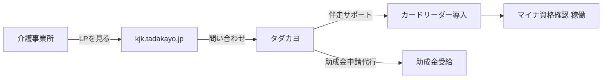
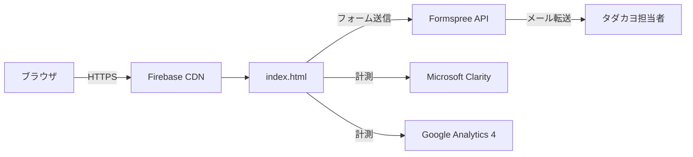

# 科学的介護情報基盤 普及推進支援LP — エンジニアノート

> プロジェクト: kjk-tadakayo  
> 担当: NPO法人タダカヨ / 次田芳尚  
> 最終更新: 2026-05-07

---

## Part A — 経営層向け

### §0 コンセプト

2026年4月から開始した「介護情報基盤」のマイナ資格確認対応を支援するランディングページ。
AB Circle製カードリーダーの販売と、補助金申請を含む伴走型サポートパック（¥61,000税別）の獲得をコンバージョンゴールとする。

### §1 背景

- 介護情報基盤：マイナンバーカードで介護保険資格をオンライン確認する仕組み（2026年4月開始）
- 2026年5月7日より介護情報基盤向け助成金の申請受付開始（申請期限：2027年3月12日）
- 助成金の存在・申請方法を知らない介護事業所が多く、タダカヨが伴走支援することで差別化

### §2 効果（期待値）

- 訪問・通所系3台構成：¥61,000（税別）= 税込¥67,100 → 助成金¥64,000 → **自己負担¥3,100**
- 「3,100円で整う、介護情報基盤。」をキャッチコピーとしてコンバージョン率向上を狙う

### §3 ユースケース



### §4 マニュアル

→ README.md 参照（作成予定）

---

## Part B — エンジニア向け

### §5 技術スタック

| 項目 | 内容 |
|---|---|
| フロントエンド | 単一HTML（index.html）/ インラインCSS+JS |
| フォント | Google Fonts — Noto Sans JP |
| アイコン | Tabler Icons v3.24.0+ (CDN) |
| フォーム送信 | Formspree（要ID差し替え） |
| アクセス解析 | Microsoft Clarity + GA4（要ID差し替え） |
| ホスティング | Firebase Hosting（kjk-tadakayo プロジェクト） |
| ドメイン | kjk.tadakayo.jp（お名前.com管理） |
| リポジトリ | https://github.com/tsuku-29/kjk-tadakayo |

### §6 アーキテクチャ図



### §7 ファイル構成

```
tadakiayo-kiban/
├── index.html          # LP本体（全セクションインライン）
├── firebase.json       # Firebase Hosting設定
├── .firebaserc         # プロジェクトID設定
├── CNAME               # カスタムドメイン（kjk.tadakayo.jp）
├── deploy.sh           # デプロイスクリプト
└── ENGINEERING_NOTES.md
```

### §8 LPセクション構成

| セクション | 内容 |
|---|---|
| ヘッダー（固定） | タダカヨロゴ / 無料相談ボタン（#contactへ） |
| 緊急バナー | 助成金申請開始日・期限の強調 |
| ヒーロー | キャッチ「3,100円で整う」/ 計算カード / CTA×2 |
| 問題提起 | 介護情報基盤とは / 未対応リスク |
| 助成金比較 | 介護情報基盤助成金 vs ICT補助金の優位性 |
| 助成金早見表 | 3種別 × 上限額 × 台数 |
| 製品紹介 | CIR415A（Bluetooth）/ CIR315A（USB） |
| おまかせパック | ¥61,000内訳 / 実質負担額 |
| タダカヨの強み | NPO非営利 / 介護DX専門 / 1年伴走 |
| FAQ | 4問 |
| お問い合わせ | Formspreeフォーム（#contact） |
| フッター | タダカヨ情報 |

### §9 助成金ロジック（重要）

**なぜ¥61,000が最適か：**

- 介護情報基盤助成金（定額型）：訪問・通所系3台 → 上限¥64,000（税込）
- ICT導入支援事業（割合型3/4）：同額なら補助額¥45,750 → 自己負担¥15,250と大幅に不利
- ¥61,000（税別）= ¥67,100（税込）→ 助成金¥64,000を引くと自己負担**¥3,100**
- 「定額型助成金の上限内に税込価格を収める」設計

### §10 デプロイ

```bash
# yoshinao-tsukuda@tadakayo.jp アカウントでログイン済みであること
bash deploy.sh
# または
firebase deploy --only hosting --project kjk-tadakayo
```

- 本番URL: https://kjk-tadakayo.web.app
- カスタムドメイン: https://kjk.tadakayo.jp（DNS設定後）

### §11 DNS設定（お名前.com）

| TYPE | ホスト名 | VALUE |
|---|---|---|
| CNAME | `kjk` | `kjk-tadakayo.web.app` |

### §12 プレースホルダー一覧（要差し替え）

| 場所 | プレースホルダー | 取得先 |
|---|---|---|
| フォームaction | `PLACEHOLDER` | https://formspree.io |
| Clarity | `CLARITY_PROJECT_ID` | https://clarity.microsoft.com → wax7x03bg8 |
| GA4 | `G-XXXXXXXXXX` | analytics.google.com → G-0NZY6PM3FG |

---

## Part C — 記録

### §13 現在の状態（2026-05-07 更新）

- index.html 制作完了・Firebase Hosting デプロイ済み: https://kjk-tadakayo.web.app
- GitHub push 済み（tsuku-29/kjk-tadakayo）最新コミット: `39d9f31`
- カスタムドメイン: Firebase Console設定済み / お名前.comのCNAME設定を藤田さんに依頼中
- **プレースホルダー3箇所は未差し替え**（Formspree / Clarity / GA4）→ HANDOFF.md 参照

**完了済みの実装:**
- サービス名「タダサポ 介護情報基盤版」確定・全LP反映済み
- 価格: CIR415A×3台 ¥27,000 ＋ サポート¥30,000 = ¥57,000(税別)＝¥62,700(税込)　自己負担¥0
- 製品写真（images/ フォルダ）・キャラクター画像（chara_1〜11）・ロゴ画像 配置済み
- 全画像の白背景透過処理済み（Pillow）
- 助成金早見表：3行すべてにBT/USB両プランと自己負担¥0バッジ表示

### §14 設計議論

**助成金フレームの選択（2026-05-07）**
ICT導入支援事業（割合型）と介護情報基盤助成金（定額型）を比較した結果、定額型が大幅に有利と判明。

| 比較 | 介護情報基盤 助成金（定額型）| ICT導入支援（割合型3/4） |
|---|---|---|
| 訪問・通所系3台 | **¥64,000（上限まで全額）** | ¥62,700×3/4=¥47,025 |
| 自己負担 | **¥0** | ¥15,675 |

**価格を¥61,000→¥57,000に変更した経緯（2026-05-07）**
当初は税込¥67,100（¥61,000税別）設計だったが、税込¥62,700（¥57,000税別）に変更することで助成金上限¥64,000以内に収まり、全パターン自己負担¥0を実現。サポート費を¥34,000→¥30,000(税別)に調整。

**全6パターン自己負担¥0の根拠（PRICING.md参照）**
- 訪問・通所系: BT×3台¥62,700 / USB×3台¥49,500 → 上限¥64,000以内
- 居住・入所系: BT×2台¥53,900 / USB×2台¥45,100 → 上限¥55,000以内
- その他: BT×1台¥40,700 / USB×1台¥36,300 → 上限¥42,000以内

### §15 ADR

- ADR-001: 単一HTMLファイル構成を採用（Next.js等不使用）→ Firebase Hostingへの直デプロイを優先、更新コストを最小化
- ADR-002: 画像は `images/` サブフォルダで管理 → Firebase Hosting で静的ファイルとして配信
- ADR-003: キャラクター画像はPillowで白背景透過処理 → OS間の描画差異をなくし、有色背景でも自然に表示

### §16 変更履歴

| 日付 | 内容 |
|---|---|
| 2026-05-07 | index.html 初版作成・Firebase Hosting デプロイ・GitHub push |
| 2026-05-07 | ENGINEERING_NOTES.md / PRICING.md 作成 |
| 2026-05-07 | サービス名「タダサポ 介護情報基盤版」確定・価格¥57,000(税別)に変更 |
| 2026-05-07 | 製品写真・キャラクター画像追加、全画像白背景透過処理 |
| 2026-05-07 | ヘッダーロゴをタダカヨロゴ画像に差し替え |
| 2026-05-07 | 助成金早見表を3行すべてBT/USB両プラン表示に統一・HANDOFF.md 作成 |
