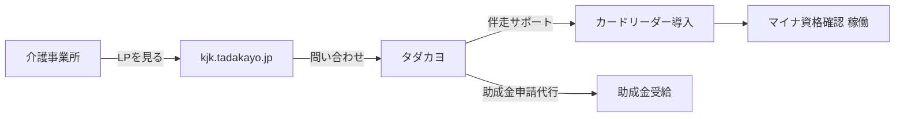
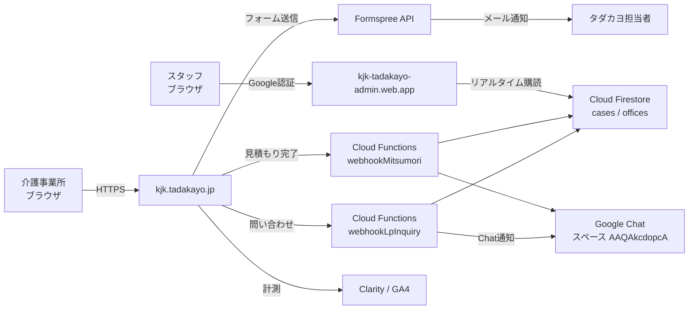
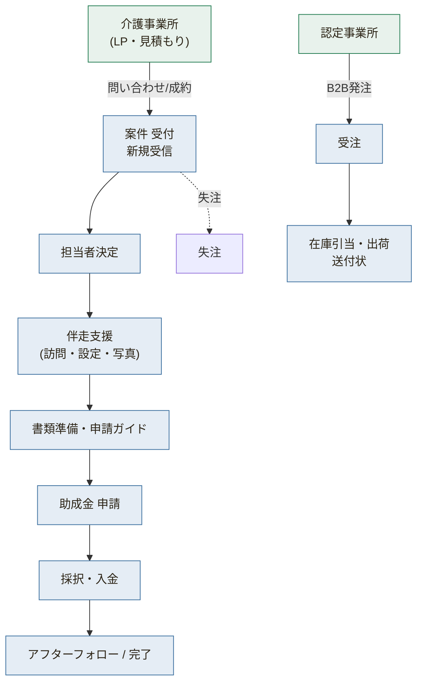
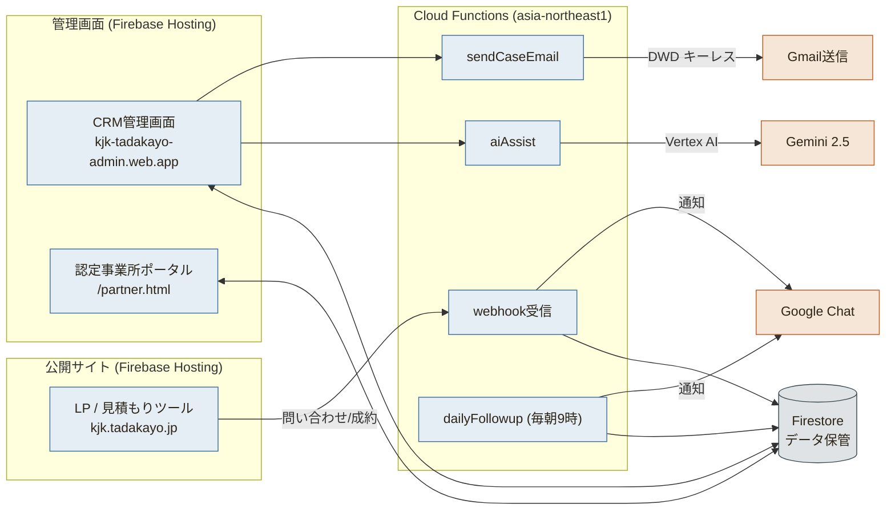
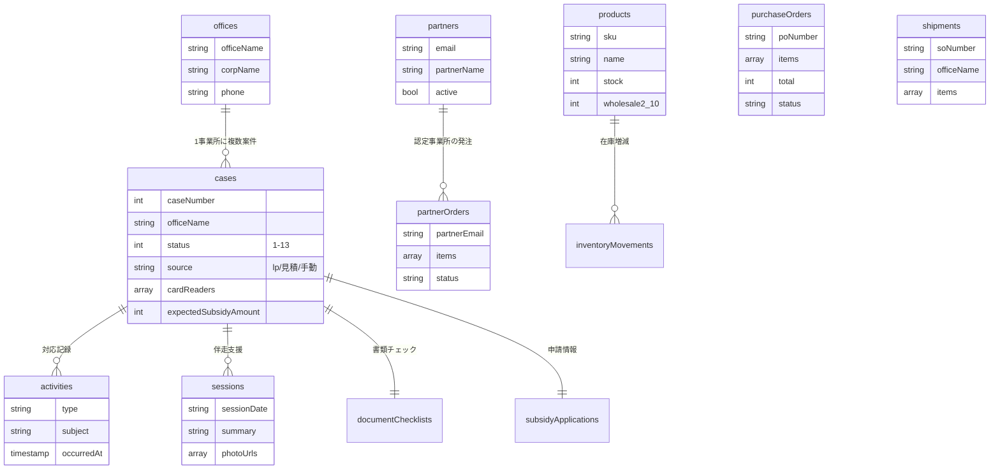
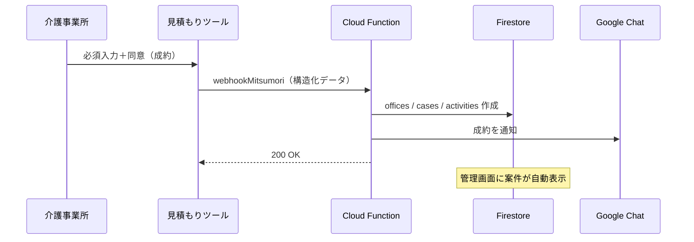

# 科学的介護情報基盤 普及推進支援 — エンジニアノート（LP / CRM）

> プロジェクト: kjk-tadakayo  
> 担当: NPO法人タダカヨ / 次田芳尚  
> 最終更新: 2026-05-27

---

## Part A — 経営層向け

### §0 コンセプト

2026年4月から開始した「介護情報基盤」のマイナ資格確認対応を支援するランディングページ。
AB Circle製カードリーダーの販売と、補助金申請を含む伴走型サポートパック（¥61,000税別）の獲得をコンバージョンゴールとする。

### §1 背景

- 介護情報基盤：マイナンバーカードで介護保険資格をオンライン確認する仕組み（2026年4月開始）
- 2026年5月7日より介護情報基盤向け助成金の申請受付開始（申請期限：2027年3月12日）
- 助成金の存在・申請方法を知らない介護事業所が多く、タダカヨが伴走支援することで差別化

### §2 効果（期待値）

- 訪問・通所系3台構成：¥61,000（税別）= 税込¥67,100 → 助成金¥64,000 → **自己負担¥3,100**
- 「3,100円で整う、介護情報基盤。」をキャッチコピーとしてコンバージョン率向上を狙う

### §3 ユースケース



### §4 マニュアル

→ README.md 参照（作成予定）

---

## Part B — エンジニア向け

### §5 技術スタック

#### LP（ランディングページ）
| 項目 | 内容 |
|---|---|
| フロントエンド | 単一HTML（index.html）/ インラインCSS+JS |
| フォント | Google Fonts — Noto Sans JP |
| アイコン | Tabler Icons v3.24.0+ (CDN) |
| フォーム送信 | Formspree（xjglevjk） |
| アクセス解析 | Microsoft Clarity (wax7x03bg8) + GA4 (G-0NZY6PM3FG) |
| ホスティング | Firebase Hosting target: `lp`（kjk-tadakayo.web.app） |
| ドメイン | kjk.tadakayo.jp（お名前.com管理） |

#### CRM 管理画面（Phase 1 / 2026-05-27 実装）
| 項目 | 内容 |
|---|---|
| フロントエンド | Vanilla JS (ES Module) + Firebase SDK v10 CDN |
| フォント | Noto Serif JP（見出し）/ Inter・Noto Sans JP（本文） |
| アイコン | Tabler Icons v3.24.0+ (CDN) |
| 認証 | Firebase Auth (Google / @tadakayo.jp ドメイン制限) |
| データベース | Cloud Firestore (asia-northeast1) |
| ストレージ | Cloud Storage (asia-northeast1) |
| バックエンド | Cloud Functions v2 (Node 20 / asia-northeast1) |
| ホスティング | Firebase Hosting target: `admin`（kjk-tadakayo-admin.web.app） |
| セキュリティ | Firestore Rules + Storage Rules (@tadakayo.jp 制限) |

共通
| 項目 | 内容 |
|---|---|
| Firebase プロジェクト | kjk-tadakayo |
| リポジトリ | https://github.com/tsuku-29/kjk-tadakayo |

### §6 アーキテクチャ図



### §7 ファイル構成

```
tadakiayo-kiban/
├── index.html                # LP本体
├── mitsumori.html            # 見積もりツール
├── firebase.json             # multi-site hosting + functions + rules
├── .firebaserc               # LP(lp) / CRM管理(admin) target設定
├── firestore.rules           # @tadakayo.jp 制限セキュリティルール
├── storage.rules             # @tadakayo.jp 制限ストレージルール
├── deploy.sh                 # デプロイスクリプト（--lp-only オプションあり）
├── admin/                    # CRM管理画面（static）
│   ├── index.html            # ログイン画面
│   ├── cases.html            # 案件一覧
│   ├── case-detail.html      # 案件詳細（タイムライン/書類チェック/申請情報）
│   ├── js/
│   │   ├── firebase-config.js  # Firebase設定（REPLACE_WITH_ACTUAL_* 要差し替え）
│   │   ├── auth.js            # 共通認証ガード（現在はindex.htmlに統合）
│   │   ├── cases.js           # 案件一覧ロジック
│   │   └── case-detail.js     # 案件詳細ロジック
│   └── css/
│       └── crm.css            # CRM専用スタイル（v4デザインシステム準拠）
├── functions/                 # Cloud Functions v2
│   ├── package.json
│   └── index.js               # webhookLpInquiry / webhookMitsumori
├── images/                    # LP用画像
└── ENGINEERING_NOTES.md
```

### §8 LPセクション構成

| セクション | 内容 |
|---|---|
| ヘッダー（固定） | タダカヨロゴ / 無料相談ボタン（#contactへ） |
| 緊急バナー | 助成金申請開始日・期限の強調 |
| ヒーロー | キャッチ「3,100円で整う」/ 計算カード / CTA×2 |
| 問題提起 | 介護情報基盤とは / 未対応リスク |
| 助成金比較 | 介護情報基盤助成金 vs ICT補助金の優位性 |
| 助成金早見表 | 3種別 × 上限額 × 台数 |
| 製品紹介 | CIR415A（Bluetooth）/ CIR315A（USB） |
| おまかせパック | ¥61,000内訳 / 実質負担額 |
| タダカヨの強み | NPO非営利 / 介護DX専門 / 1年伴走 |
| FAQ | 4問 |
| お問い合わせ | Formspreeフォーム（#contact） |
| フッター | タダカヨ情報 |

### §9 助成金ロジック（重要）

**なぜ¥61,000が最適か：**

- 介護情報基盤助成金（定額型）：訪問・通所系3台 → 上限¥64,000（税込）
- ICT導入支援事業（割合型3/4）：同額なら補助額¥45,750 → 自己負担¥15,250と大幅に不利
- ¥61,000（税別）= ¥67,100（税込）→ 助成金¥64,000を引くと自己負担**¥3,100**
- 「定額型助成金の上限内に税込価格を収める」設計

### §10 デプロイ

```bash
# yoshinao-tsukuda@tadakayo.jp アカウントでログイン済みであること
bash deploy.sh
# または
firebase deploy --only hosting --project kjk-tadakayo
```

- 本番URL: https://kjk-tadakayo.web.app
- カスタムドメイン: https://kjk.tadakayo.jp（DNS設定後）

### §11 DNS設定（お名前.com）

| TYPE | ホスト名 | VALUE |
|---|---|---|
| CNAME | `kjk` | `kjk-tadakayo.web.app` |

### §12 プレースホルダー一覧（要差し替え）

| 場所 | プレースホルダー | 取得先 |
|---|---|---|
| フォームaction | `PLACEHOLDER` | https://formspree.io |
| Clarity | `CLARITY_PROJECT_ID` | https://clarity.microsoft.com → wax7x03bg8 |
| GA4 | `G-XXXXXXXXXX` | analytics.google.com → G-0NZY6PM3FG |

---

## Part C — 記録

### §13 現在の状態（2026-06-02 更新）

#### LP / 見積もりツール
- 本番稼働中: https://kjk.tadakayo.jp / https://kjk.tadakayo.jp/mitsumori.html
- 令和8年度申請期間（2026-05-07〜2027-03-12）・USB¥6,500・全35サービス対応済み
- **2026-06-02 本番動作確認 PASS**（Playwrightで観察検証）: 申請期間・メーカー価格（¥17,380/¥7,150）・補助金区分（¥64,000/¥55,000/¥42,000）・見積もり計算5パターン（補助対象は自己負担¥0／補助対象外は自己負担計上）・Clarity/GA4 を確認
- **2026-06-02 補助金完全リストを35コード逐語化**（LP表＋見積もり折りたたみ）: 区分① 18 / 区分② 12 / 区分③ 5。短期入所療養介護の3種別・各「短期利用」バリアントを明示。それ以前は28行の集約表示だった
- **2026-06-02 favicon/apple-touch-icon に `images/tadakayo_logo.png` を設定**（favicon.ico 404 を解消）
- **2026-06-02 見積書の税表記を修正**: 明細テーブル見出しを「単価/金額（税別）」→「（税込）」に修正。定数・計算・備考（行1420「本見積書の金額はすべて消費税10%を含む税込金額で表示」）はすべて税込ベースで、消費税の別途加算は無し。見出しのみラベル誤りだった

#### CRM 管理画面（Phase 1 実装完了・デプロイ待ち）
- **コード実装完了** (コミット `307a01b`, CSSfix `1d4efda`)
- **Firebase Console の設定待ち** → `CRM_SETUP_GUIDE.md` 参照
- デプロイ後 URL: https://kjk-tadakayo-admin.web.app
- `admin/js/firebase-config.js` の `REPLACE_WITH_ACTUAL_*` を Firebase Console で差し替え必須

#### GitHub
- 最新コミット: `2dbe775`（main / push済み 2026-06-02）
- push は fine-grained PAT（`tsuku-29/kjk-tadakayo` 限定・2026-08-06まで）をURL埋め込みで実行（memory `feedback_deploy.md` 参照）

#### 実装済み機能（Phase 1）
- ログイン画面（Google / @tadakayo.jp 制限・`signInWithPopup`）
- 案件一覧（リアルタイム購読・検索・フィルタ・新規登録モーダル・申請期限カウントダウン）
- 案件詳細（対応記録タイムライン / 書類チェック4項目+口座情報 / 申請情報7段階）
- Webhook受信（LP問い合わせ・見積もり成約 → Firestore自動登録・重複検出・Chat通知）
- Firestoreセキュリティルール (@tadakayo.jp 制限)
- Storageセキュリティルール (@tadakayo.jp 制限)

### §14 設計議論

**助成金フレームの選択（2026-05-07）**
ICT導入支援事業（割合型）と介護情報基盤助成金（定額型）を比較した結果、定額型が大幅に有利と判明。

| 比較 | 介護情報基盤 助成金（定額型）| ICT導入支援（割合型3/4） |
|---|---|---|
| 訪問・通所系3台 | **¥64,000（上限まで全額）** | ¥62,700×3/4=¥47,025 |
| 自己負担 | **¥0** | ¥15,675 |

**価格を¥61,000→¥57,000に変更した経緯（2026-05-07）**
当初は税込¥67,100（¥61,000税別）設計だったが、税込¥62,700（¥57,000税別）に変更することで助成金上限¥64,000以内に収まり、全パターン自己負担¥0を実現。サポート費を¥34,000→¥30,000(税別)に調整。

**全6パターン自己負担¥0の根拠（PRICING.md参照）**
- 訪問・通所系: BT×3台¥62,700 / USB×3台¥49,500 → 上限¥64,000以内
- 居住・入所系: BT×2台¥53,900 / USB×2台¥45,100 → 上限¥55,000以内
- その他: BT×1台¥40,700 / USB×1台¥36,300 → 上限¥42,000以内

### §15 ADR

- ADR-001: 単一HTMLファイル構成を採用（Next.js等不使用）→ Firebase Hostingへの直デプロイを優先、更新コストを最小化
- ADR-002: 画像は `images/` サブフォルダで管理 → Firebase Hosting で静的ファイルとして配信
- ADR-003: キャラクター画像はPillowで白背景透過処理 → OS間の描画差異をなくし、有色背景でも自然に表示

### §16 変更履歴

| 日付 | 内容 |
|---|---|
| 2026-05-07 | index.html 初版作成・Firebase Hosting デプロイ・GitHub push |
| 2026-05-07 | ENGINEERING_NOTES.md / PRICING.md 作成 |
| 2026-05-07 | サービス名「タダサポ 介護情報基盤版」確定・価格¥57,000(税別)に変更 |
| 2026-05-07 | 製品写真・キャラクター画像追加、全画像白背景透過処理 |
| 2026-05-07 | ヘッダーロゴをタダカヨロゴ画像に差し替え |
| 2026-05-07 | 助成金早見表を3行すべてBT/USB両プラン表示に統一・HANDOFF.md 作成 |
| 2026-05-22 | USB価格¥6,500改定・居宅介護支援を¥64,000区分に修正・全35サービス完全リスト反映 |
| 2026-05-27 | CRM Phase 1 実装完了（admin/ + functions/ + firestore.rules + storage.rules + firebase.json multi-site化）|
| 2026-06-02 | LP本番動作確認PASS／補助金完全リストを35コード逐語化／favicon追加（`deploy.sh --lp-only` 本番デプロイ・コミット `2dbe775` push済）|
| 2026-06-02 | 見積書明細の税表記を「（税別）」→「（税込）」に修正（ラベル誤り・本番デプロイ済）|
| 2026-05-27 | TECHNICAL_SPEC.md・工数試算書.md 新規作成・社内PDF共有 |
| 2026-05-27 | 令和8年度申請期間（2026-05-07〜2027-03-12）に更新 |
| 2026-06-05 | 発注書の実印影対応（設定で印影画像アップロード→黒背景透過→`appConfig/settings.poSealImage`／supply-printが``描画・`505832a`）|
| 2026-06-05 | GCPセキュリティ改修5件: H-1 Delete Protection／H-5 Vertex AI=asia-northeast1（コード既定値含む`8568249`）／M-4 localhost削除／H-2 PITR(7日)／M-2 CHAT_WEBHOOK_URL Secret Manager化(`2dff953`) |
| 2026-06-05 | 残セキュリティ: M-1(App Check・専用session)／H-3,H-4(Phase4 IAM)／M-5,M-3(Phase5)。付帯: Gemini2.5 retire 2026-10-16→G3移行 |
| 2026-06-05 | 請求書の振込先口座を設定対応（settings.html/js に billing* 5項目／supply-print `renderInvoice` が実値表示・未設定は従来の「別途ご案内」文言）。構文/3ファイル整合チェック済・admin hostingデプロイは承認待ち |
| 2026-06-05 | 実機検証チェックリスト.md 作成（@tadakayoログイン前提の全機能通し確認・13セクション） |
| 2026-06-05 | セキュリティ続報: H-4 は全SA（appspot/gmail-sa/compute）で USER_MANAGED 鍵ゼロ＝**実態クリア**と判明（キーレスDWD運用・追加対応不要）。H-3 は6関数が compute SA（roles/editor＋aiplatform.user）共有を確認。SECURITY_REMEDIATION.md（開発チーム向け対応状況レポート）作成 |
| 2026-06-05 | M-5 Cloud Monitoring 完了: メール通知ch＋「Cloud Run(関数)5xxエラー検知」ポリシー作成（policy 17664915398047705537 / channel 17803807182395282661・要メールverify）。指摘10件は実質7件完了、残=M-1/H-3/M-3＋Gemini移行 |
| 2026-06-05 | 発注モーダル(→AB Circle)の送付先に認定事業所セレクト追加（`activePartners`・選択で〒/住所/法人名・事業所名を自動入力・手入力可。supply.html/js `fillOrderShipTo`・`055ae42`） |
| 2026-06-05 | 本書に CRM システムの技術仕様（業務フロー/アーキテクチャ/ER/シーケンスの4図＋コレクション一覧＋認証＋デプロイ）を統合（アプリ内 engineering.html を正本化）／MANUAL.md 新規作成／partner.html モバイル対応／COOP `same-origin-allow-popups` 設定／.gitignore 整理 |
| 2026-06-05 | 本番デプロイ（COOP/partner/docs）実施。COOPが `source:"**/*.html"` では cleanUrls 下でマッチせず無効と判明→`source:"**"` に修正（`ebf3ae1`）。残存 worktree 4つを整理（main 1本に） |
| 2026-06-05 | 発注機能 仮作成→確定→送付（`1739c29`）: 発注を下書き(draft)→編集→確定の3段階化＋希望納期。「確定して送付」で発注書PDF(html2pdf)を添付しABサークルへGmail送信（プレビュー編集可）。設定に仕入先(supplier*)・発注メール定型文(poMail*)追加。商品マスタにJAN・wholesale31投入＋発注単価を数量帯別(unitPriceFor)。functions buildRawMessage を multipart 対応＋`sendSupplierOrder` callable 追加。発注書描画を `admin/js/po-doc.js` に共通化。AB Circle 2026-06-05 回答(memory reference_abcircle)反映 |
| 2026-06-05 | 任意改善＋下調べ: 発注の送料自動化(`fc0c4c1`・地域選択でAB送料表から自動入力)／出荷(直送)を数量帯別単価＋LP headers を cleanUrls対応(`cb6f4b5`・html=no-cache/アセット=immutable両立)／HANDOFF スリム化 745→283行+`HANDOFF_ARCHIVE.md`退避(`18add8b`)／M-1・H-3 下調べ(`98cedca`・H-3対象7関数化・前提API未有効・担当分離手順を SECURITY_REMEDIATION 末尾に) |
| 2026-06-05 | **M-1完了(observe)＋H-3 SA移行**（セッション⑥）: M-1=LP2フォームに App Check(reCAPTCHA Enterprise)組込＋functions で `X-Firebase-AppCheck` を手動検証（観察モード・`APPCHECK_ENFORCE`既定false=弾かない）。本番 kjk.tadakayo.jp で正規トークン発行＋サーバー `verified` 実証（`089aeb6`／観察ログ改善 `ae4af8f`）。H-3=4専用SA（fn-webhook/batch/ai/mail-sa）へ全7関数を最小権限で移行・実行SA切替を確認（`c8b8e9a`）。compute SA の editor は安全網として保持（剥奪は次回・管理画面でAI/メール確認＋1-2日監視後）。詳細は SECURITY_REMEDIATION §1/§2 |
| 2026-06-06 | **M-1 強制化＋H-3 editor剥奪まで完了（GCP指摘10件すべて完了）**: M-1=App Check検証を fail-secure 強制（コード既定 `APPCHECK_ENFORCE !== "false"`）に変更し webhook 2本を本番再デプロイ。トークンなしPOST=**401**／本番ブラウザの正規トークン=**200** を実証（テスト案件削除）。H-3=compute SA から `roles/editor`＋`roles/aiplatform.user` を剥奪し、gen2ビルド用 `roles/cloudbuild.builds.builder` のみに縮小。**editor無しでテストデプロイ成功＝ビルド能力維持を確認**。全7関数は最小権限の専用SAで稼働。付帯 Gemini2.5→3 移行・Node20→22/firebase-functions更新は10月期限の保守として見送り（現行正常動作・要@tadakayo出力検証） |
| 2026-06-06 | **CRM管理画面ブラッシュアップ（推奨パック・commit `d983121`）**: C1=`admin/js/constants.js`新設でステータス/フェーズ/色/流入元/期限の定義を一元化（cases/kanban/dashboard/case-detailの重複排除・SOURCEラベル不統一解消）。A1=案件ステータスを13→5フェーズ表示（①受付受注②準備③伴走支援④申請採択⑤完了フォロー＋失注／数値1-13不変）。カンバン=5フェーズ列＋失注（カードにサブ状態セレクト）、一覧フィルタ・詳細選択=フェーズ別optgroup、ダッシュボード=フェーズ別集計。B1=空状態の区別＋alert()廃止→トースト/インラインエラー。B2=在庫調整prompt()廃止→正式モーダル。hosting:admin プレビュー→本番昇格。残提案: A2/A3画面整理・B3推移グラフ・B4期限設定化・C2ファイル分割・Dモバイル |
| 2026-06-06 | **帳票に角印（会社印）＋担当者印を追加（commit `e8952ef`）**: 「NPO法人タダカヨ」名称の右に角印（タダカヨ2x2・CSS div方式でhtml2canvas互換＝発注書PDFにも描画）を請求書(supply-print)・発注書(po-doc)へ。発注書の発注者の右に担当者の個人印（丸印・`surnameOf`で氏名から姓を自動抽出して生成、`poSealImage`があれば画像優先）。角印78px=既存の担当者印(64px/画像72px)より少し大きめ＝一般的サイズ。`sealKakuHtml`/`surnameOf`をpo-doc.jsにexportし請求書側と共通利用。hosting:admin プレビュー→本番昇格 |
| 2026-06-06 | **角印の役割を整理**（次田さん指示）: アップロード印影画像(`poSealImage`)を「会社角印（タダカヨ）」として請求書・発注書の**名称の右**に表示（未登録なら文字の角印にフォールバック・82px）。発注書の**発注者印は`poSealImage`を使わず常に姓から自動生成の丸印**に変更（会社角印と担当者印を分離）。設定文言も「会社角印の画像／担当者印の文字」に更新。hosting:admin 昇格 |
| 2026-06-06 | **帳票の発注者を複数選択化＋微調整**: ABサークル発注の発注者を設定で複数登録（`poOrderers`・1行1名／旧 `poOrdererName` から移行）→発注モーダルで選択し `purchaseOrders.ordererName` に保存。POの発注者名・担当者印（姓）が選択に追従（`po-doc.js`）。あわせて印鑑の傾き(`transform:rotate`)を全廃し直立に／帳票から「供給管理へ」で元タブ（出荷/発注/受注/パートナー）の一覧へ戻るよう `?tab=` 対応（supply-print.js/supply.js）。いずれも hosting:admin 昇格 |

---

# CRM（管理画面）システム — エンジニアノート

> 2026-06-05 統合。LP・見積もりツールからの問い合わせを「案件」として受け、伴走支援・助成金申請・カードリーダーの発注/在庫/出荷/請求までを一元管理する管理画面（CRM）の技術仕様。アプリ内 `admin/engineering.html` と同一内容を SSOT として本書に集約。

## §C0 何のシステムか

介護事業所の「介護情報基盤」導入を NPO法人タダカヨが伴走支援する事業の管理システム。LP・見積もりツールからの問い合わせを案件として受け取り、担当・伴走支援・助成金申請・カードリーダーの発注/在庫/出荷までを一元管理する。

## §C1 業務フロー（FLOW）



## §C2 アーキテクチャ（ARCH）



## §C3 データモデル（ER）



| コレクション | 役割 |
|---|---|
| `cases` | 案件（問い合わせ〜完了の中心データ） |
| `offices` | 介護事業所マスタ |
| `activities` | 対応記録（電話・メール・訪問・メモ・メール送信） |
| `sessions` | 伴走支援セッション（日付・メモ・写真） |
| `documentChecklists / subsidyApplications` | 書類チェック・助成金申請情報 |
| `products / inventoryMovements` | 商品マスタ・在庫増減ログ |
| `purchaseOrders / shipments` | 発注（→AB Circle）・出荷（→事業所） |
| `partners / partnerOrders` | 認定事業所の許可リスト・受注 |
| `appConfig/settings` | Webhook URL・送信元・振込先・印影などの設定 |
| `_counters` | 案件番号・発注/出荷番号の採番 |

## §C4 シーケンス：見積もり成約 → 案件登録（SEQ）



## §C5 認証・セキュリティ

- 管理画面: **Googleログイン＋@tadakayo.jp 限定**（Firestoreルールで強制）。組織の Workspace 2段階認証で2要素を担保（M-3）
- 認定事業所ポータル: Googleログイン＋**許可リスト**（partners）。自分の発注のみ閲覧
- メール送信: **ドメイン全体委任（DWD）・キーレス**（鍵を保存せず都度署名）。スコープは `gmail.send` のみ
- AI: **Vertex AI + SA認証**（裸APIキー不使用）
- ログイン: `signInWithPopup`（rule02準拠・redirect不使用）。COOP `same-origin-allow-popups` を admin HTML ヘッダに設定
- 詳細なセキュリティ対応状況・残件計画は `SECURITY_REMEDIATION.md` を参照

## §C6 デプロイ・運用

| 項目 | 値 |
|---|---|
| Firebaseプロジェクト | `kjk-tadakayo` |
| 公開LP | https://kjk.tadakayo.jp |
| 管理画面 | https://kjk-tadakayo-admin.web.app |
| 認定事業所ポータル | https://kjk-tadakayo-admin.web.app/partner.html |
| リージョン | asia-northeast1（Vertex AI も H-5 で global → asia-northeast1 に変更済） |
| デプロイ | Node20 / `firebase deploy`（rule05: preview channel → 検証 → 本番昇格） |

> [!INFO]
> Webhook URL・メール送信元・振込先・印影などは「設定」画面（`appConfig/settings`）から変更でき、コード変更・再デプロイは不要（最大60秒で反映）。
