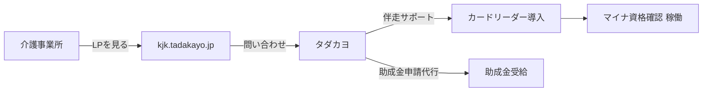
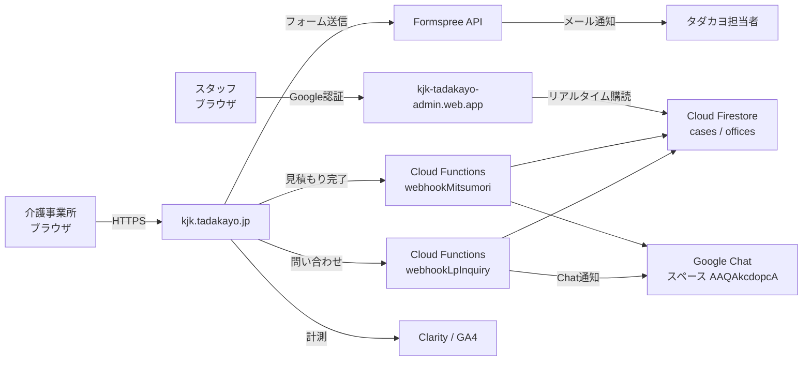
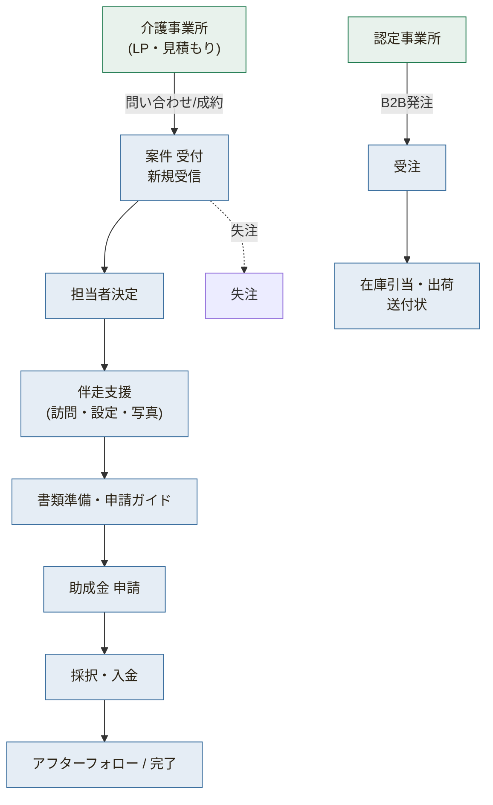
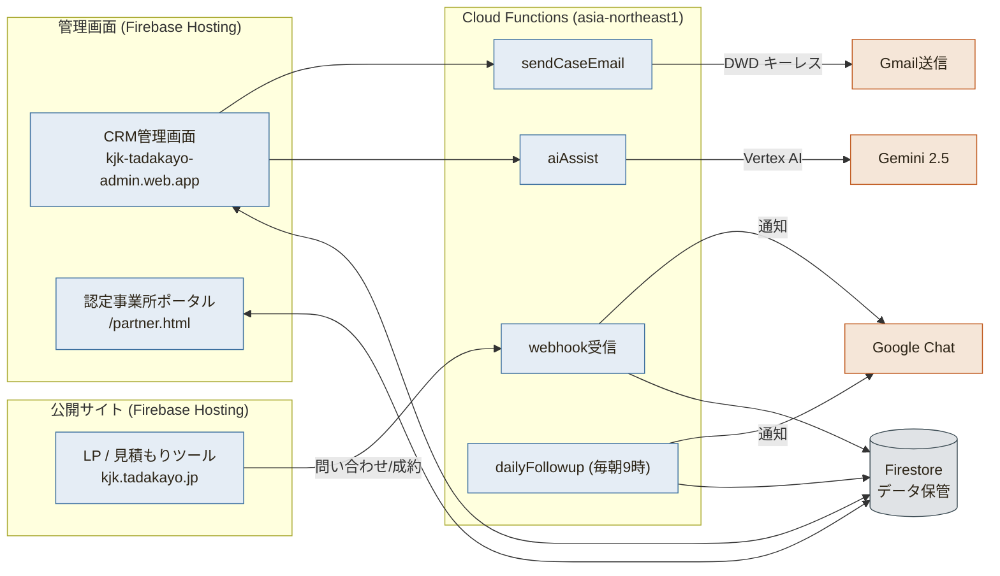
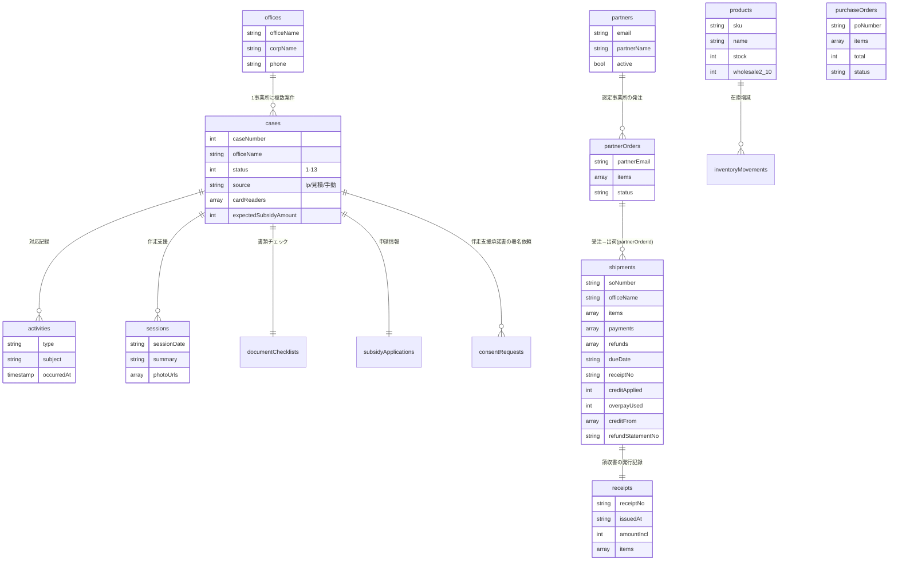
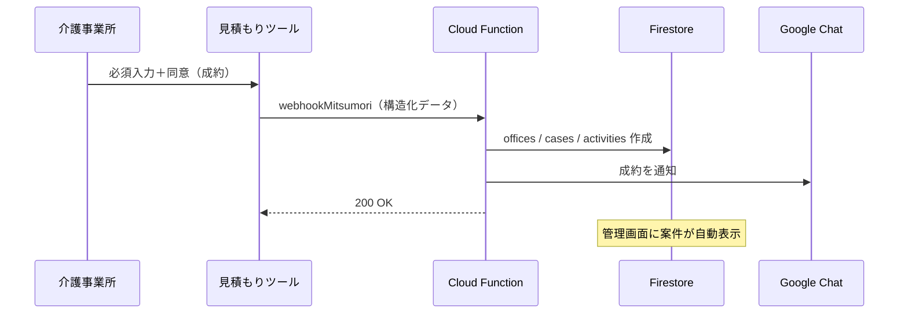

# 科学的介護情報基盤 普及推進支援 — エンジニアノート（LP / CRM）

> プロジェクト: kjk-tadakayo  
> 担当: NPO法人タダカヨ / 次田芳尚  
> 最終更新: 2026-05-27

---

## Part A — 経営層向け

### §0 コンセプト

2026年4月から開始した「介護情報基盤」のマイナ資格確認対応を支援するランディングページ。
AB Circle製カードリーダーの販売と、補助金申請を含む伴走型サポートパック（¥61,000税別）の獲得をコンバージョンゴールとする。

### §1 背景

- 介護情報基盤：マイナンバーカードで介護保険資格をオンライン確認する仕組み（2026年4月開始）
- 2026年5月7日より介護情報基盤向け助成金の申請受付開始（申請期限：2027年3月12日）
- 助成金の存在・申請方法を知らない介護事業所が多く、タダカヨが伴走支援することで差別化

### §2 効果（期待値）

- 訪問・通所系3台構成：¥61,000（税別）= 税込¥67,100 → 助成金¥64,000 → **自己負担¥3,100**
- 「3,100円で整う、介護情報基盤。」をキャッチコピーとしてコンバージョン率向上を狙う

### §3 ユースケース


```mermaid
flowchart LR
    A[介護事業所] -->|LPを見る| B[kjk.tadakayo.jp]
    B -->|問い合わせ| C[タダカヨ]
    C -->|伴走サポート| D[カードリーダー導入]
    C -->|助成金申請代行| E[助成金受給]
    D --> F[マイナ資格確認 稼働]
```

### §4 マニュアル

→ README.md 参照（作成予定）

---

## Part B — エンジニア向け

### §5 技術スタック

#### LP（ランディングページ）
| 項目 | 内容 |
|---|---|
| フロントエンド | 単一HTML（index.html）/ インラインCSS+JS |
| フォント | Noto Sans JP（自己ホスト・サブセット可変woff2 / `fonts/build-subset.sh`） |
| アイコン | Tabler Icons v3.24.0（自己ホスト・使用アイコンのみサブセット8KB / `fonts/build-tabler-subset.sh` で再生成。アイコン追加時は再実行必須） |
| フォーム送信 | Formspree（xjglevjk） |
| アクセス解析 | Microsoft Clarity (wax7x03bg8) + GA4 (G-V70326L8MW) |
| ホスティング | Firebase Hosting target: `lp`（kjk-tadakayo.web.app） |
| ドメイン | kjk.tadakayo.jp（お名前.com管理） |

#### CRM 管理画面（Phase 1 / 2026-05-27 実装）
| 項目 | 内容 |
|---|---|
| フロントエンド | Vanilla JS (ES Module) + Firebase SDK v10 CDN |
| フォント | Noto Serif JP（見出し）/ Inter・Noto Sans JP（本文） |
| アイコン | Tabler Icons v3.24.0+ (CDN) |
| 認証 | Firebase Auth (Google / @tadakayo.jp ドメイン制限) |
| データベース | Cloud Firestore (asia-northeast1) |
| ストレージ | Cloud Storage (asia-northeast1) |
| バックエンド | Cloud Functions v2 (Node 20 / asia-northeast1) |
| ホスティング | Firebase Hosting target: `admin`（kjk-tadakayo-admin.web.app） |
| セキュリティ | Firestore Rules + Storage Rules (@tadakayo.jp 制限) |

共通
| 項目 | 内容 |
|---|---|
| Firebase プロジェクト | kjk-tadakayo |
| リポジトリ | https://github.com/tsuku-29/kjk-tadakayo |

### §6 アーキテクチャ図


```mermaid
flowchart LR
    User[介護事業所\nブラウザ] -->|HTTPS| LP[kjk.tadakayo.jp]
    LP -->|フォーム送信| Formspree[Formspree API]
    Formspree -->|メール通知| Admin[タダカヨ担当者]
    LP -->|見積もり完了| Fn2[Cloud Functions\nwebhookMitsumori]
    LP -->|問い合わせ| Fn1[Cloud Functions\nwebhookLpInquiry]
    Fn1 --> FS[Cloud Firestore\ncases / offices]
    Fn2 --> FS
    Fn1 -->|Chat通知| GChat[Google Chat\nスペース AAQAkcdopcA]
    Fn2 --> GChat
    Staff[スタッフ\nブラウザ] -->|Google認証| CRM[kjk-tadakayo-admin.web.app]
    CRM -->|リアルタイム購読| FS
    LP -->|計測| Clarity[Clarity / GA4]
```

### §7 ファイル構成

```
tadakiayo-kiban/
├── index.html                # LP本体
├── mitsumori.html            # 見積もりツール
├── firebase.json             # multi-site hosting + functions + rules
├── .firebaserc               # LP(lp) / CRM管理(admin) target設定
├── firestore.rules           # @tadakayo.jp 制限セキュリティルール
├── storage.rules             # @tadakayo.jp 制限ストレージルール
├── deploy.sh                 # デプロイスクリプト（--lp-only オプションあり）
├── admin/                    # CRM管理画面（static）
│   ├── index.html            # ログイン画面
│   ├── cases.html            # 案件一覧
│   ├── case-detail.html      # 案件詳細（タイムライン/書類チェック/申請情報）
│   ├── js/
│   │   ├── firebase-config.js  # Firebase設定（REPLACE_WITH_ACTUAL_* 要差し替え）
│   │   ├── auth.js            # 共通認証ガード（現在はindex.htmlに統合）
│   │   ├── cases.js           # 案件一覧ロジック
│   │   └── case-detail.js     # 案件詳細ロジック
│   └── css/
│       └── crm.css            # CRM専用スタイル（v4デザインシステム準拠）
├── functions/                 # Cloud Functions v2
│   ├── package.json
│   └── index.js               # webhookLpInquiry / webhookMitsumori
├── images/                    # LP用画像
└── ENGINEERING_NOTES.md
```

### §8 LPセクション構成

| セクション | 内容 |
|---|---|
| ヘッダー（固定） | タダカヨロゴ / 無料相談ボタン（#contactへ） |
| 緊急バナー | 助成金申請開始日・期限の強調 |
| ヒーロー | キャッチ「3,100円で整う」/ 計算カード / CTA×2 |
| 問題提起 | 介護情報基盤とは / 未対応リスク |
| 助成金比較 | 介護情報基盤助成金 vs ICT補助金の優位性 |
| 助成金早見表 | 3種別 × 上限額 × 台数 |
| 製品紹介 | CIR415A（Bluetooth）/ CIR315A（USB） |
| おまかせパック | ¥61,000内訳 / 実質負担額 |
| タダカヨの強み | NPO非営利 / 介護DX専門 / 1年伴走 |
| FAQ | 4問 |
| お問い合わせ | Formspreeフォーム（#contact） |
| フッター | タダカヨ情報 |

### §9 助成金ロジック（重要）

**なぜ¥61,000が最適か：**

- 介護情報基盤助成金（定額型）：訪問・通所系3台 → 上限¥64,000（税込）
- ICT導入支援事業（割合型3/4）：同額なら補助額¥45,750 → 自己負担¥15,250と大幅に不利
- ¥61,000（税別）= ¥67,100（税込）→ 助成金¥64,000を引くと自己負担**¥3,100**
- 「定額型助成金の上限内に税込価格を収める」設計

### §10 デプロイ

```bash
# yoshinao-tsukuda@tadakayo.jp アカウントでログイン済みであること
bash deploy.sh
# または
firebase deploy --only hosting --project kjk-tadakayo
```

- 本番URL: https://kjk-tadakayo.web.app
- カスタムドメイン: https://kjk.tadakayo.jp（DNS設定後）

### §11 DNS設定（お名前.com）

| TYPE | ホスト名 | VALUE |
|---|---|---|
| CNAME | `kjk` | `kjk-tadakayo.web.app` |

### §12 プレースホルダー一覧（要差し替え）

| 場所 | プレースホルダー | 取得先 |
|---|---|---|
| フォームaction | `PLACEHOLDER` | https://formspree.io |
| Clarity | `CLARITY_PROJECT_ID` | https://clarity.microsoft.com → wax7x03bg8 |
| GA4 | `G-XXXXXXXXXX` | analytics.google.com → G-0NZY6PM3FG |

---

## Part C — 記録

### §13 現在の状態（2026-06-02 更新）

#### LP / 見積もりツール
- 本番稼働中: https://kjk.tadakayo.jp / https://kjk.tadakayo.jp/mitsumori.html
- 令和8年度申請期間（2026-05-07〜2027-03-12）・USB¥6,500・全35サービス対応済み
- **2026-06-02 本番動作確認 PASS**（Playwrightで観察検証）: 申請期間・メーカー価格（¥17,380/¥7,150）・補助金区分（¥64,000/¥55,000/¥42,000）・見積もり計算5パターン（補助対象は自己負担¥0／補助対象外は自己負担計上）・Clarity/GA4 を確認
- **2026-06-02 補助金完全リストを35コード逐語化**（LP表＋見積もり折りたたみ）: 区分① 18 / 区分② 12 / 区分③ 5。短期入所療養介護の3種別・各「短期利用」バリアントを明示。それ以前は28行の集約表示だった
- **2026-06-02 favicon/apple-touch-icon に `images/tadakayo_logo.png` を設定**（favicon.ico 404 を解消）
- **2026-06-02 見積書の税表記を修正**: 明細テーブル見出しを「単価/金額（税別）」→「（税込）」に修正。定数・計算・備考（行1420「本見積書の金額はすべて消費税10%を含む税込金額で表示」）はすべて税込ベースで、消費税の別途加算は無し。見出しのみラベル誤りだった

#### CRM 管理画面（Phase 1 実装完了・デプロイ待ち）
- **コード実装完了** (コミット `307a01b`, CSSfix `1d4efda`)
- **Firebase Console の設定待ち** → `CRM_SETUP_GUIDE.md` 参照
- デプロイ後 URL: https://kjk-tadakayo-admin.web.app
- `admin/js/firebase-config.js` の `REPLACE_WITH_ACTUAL_*` を Firebase Console で差し替え必須

#### GitHub
- 最新コミット: `2dbe775`（main / push済み 2026-06-02）
- push は fine-grained PAT（`tsuku-29/kjk-tadakayo` 限定・2026-08-06まで）をURL埋め込みで実行（memory `feedback_deploy.md` 参照）

#### 実装済み機能（Phase 1）
- ログイン画面（Google / @tadakayo.jp 制限・`signInWithPopup`）
- 案件一覧（リアルタイム購読・検索・フィルタ・新規登録モーダル・申請期限カウントダウン）
- 案件詳細（対応記録タイムライン / 書類チェック4項目+口座情報 / 申請情報7段階）
- Webhook受信（LP問い合わせ・見積もり成約 → Firestore自動登録・重複検出・Chat通知）
- Firestoreセキュリティルール (@tadakayo.jp 制限)
- Storageセキュリティルール (@tadakayo.jp 制限)

### §14 設計議論

**助成金フレームの選択（2026-05-07）**
ICT導入支援事業（割合型）と介護情報基盤助成金（定額型）を比較した結果、定額型が大幅に有利と判明。

| 比較 | 介護情報基盤 助成金（定額型）| ICT導入支援（割合型3/4） |
|---|---|---|
| 訪問・通所系3台 | **¥64,000（上限まで全額）** | ¥62,700×3/4=¥47,025 |
| 自己負担 | **¥0** | ¥15,675 |

**価格を¥61,000→¥57,000に変更した経緯（2026-05-07）**
当初は税込¥67,100（¥61,000税別）設計だったが、税込¥62,700（¥57,000税別）に変更することで助成金上限¥64,000以内に収まり、全パターン自己負担¥0を実現。サポート費を¥34,000→¥30,000(税別)に調整。

**全6パターン自己負担¥0の根拠（PRICING.md参照）**
- 訪問・通所系: BT×3台¥62,700 / USB×3台¥49,500 → 上限¥64,000以内
- 居住・入所系: BT×2台¥53,900 / USB×2台¥45,100 → 上限¥55,000以内
- その他: BT×1台¥40,700 / USB×1台¥36,300 → 上限¥42,000以内

### §15 ADR

- ADR-001: 単一HTMLファイル構成を採用（Next.js等不使用）→ Firebase Hostingへの直デプロイを優先、更新コストを最小化
- ADR-002: 画像は `images/` サブフォルダで管理 → Firebase Hosting で静的ファイルとして配信
- ADR-003: キャラクター画像はPillowで白背景透過処理 → OS間の描画差異をなくし、有色背景でも自然に表示

### §16 変更履歴

| 日付 | 内容 |
|---|---|
| 2026-05-07 | index.html 初版作成・Firebase Hosting デプロイ・GitHub push |
| 2026-05-07 | ENGINEERING_NOTES.md / PRICING.md 作成 |
| 2026-05-07 | サービス名「タダサポ 介護情報基盤版」確定・価格¥57,000(税別)に変更 |
| 2026-05-07 | 製品写真・キャラクター画像追加、全画像白背景透過処理 |
| 2026-05-07 | ヘッダーロゴをタダカヨロゴ画像に差し替え |
| 2026-05-07 | 助成金早見表を3行すべてBT/USB両プラン表示に統一・HANDOFF.md 作成 |
| 2026-05-22 | USB価格¥6,500改定・居宅介護支援を¥64,000区分に修正・全35サービス完全リスト反映 |
| 2026-05-27 | CRM Phase 1 実装完了（admin/ + functions/ + firestore.rules + storage.rules + firebase.json multi-site化）|
| 2026-06-02 | LP本番動作確認PASS／補助金完全リストを35コード逐語化／favicon追加（`deploy.sh --lp-only` 本番デプロイ・コミット `2dbe775` push済）|
| 2026-06-02 | 見積書明細の税表記を「（税別）」→「（税込）」に修正（ラベル誤り・本番デプロイ済）|
| 2026-05-27 | TECHNICAL_SPEC.md・工数試算書.md 新規作成・社内PDF共有 |
| 2026-05-27 | 令和8年度申請期間（2026-05-07〜2027-03-12）に更新 |
| 2026-06-05 | 発注書の実印影対応（設定で印影画像アップロード→黒背景透過→`appConfig/settings.poSealImage`／supply-printが``描画・`505832a`）|
| 2026-06-05 | GCPセキュリティ改修5件: H-1 Delete Protection／H-5 Vertex AI=asia-northeast1（コード既定値含む`8568249`）／M-4 localhost削除／H-2 PITR(7日)／M-2 CHAT_WEBHOOK_URL Secret Manager化(`2dff953`) |
| 2026-06-05 | 残セキュリティ: M-1(App Check・専用session)／H-3,H-4(Phase4 IAM)／M-5,M-3(Phase5)。付帯: Gemini2.5 retire 2026-10-16→G3移行 |
| 2026-06-05 | 請求書の振込先口座を設定対応（settings.html/js に billing* 5項目／supply-print `renderInvoice` が実値表示・未設定は従来の「別途ご案内」文言）。構文/3ファイル整合チェック済・admin hostingデプロイは承認待ち |
| 2026-06-05 | 実機検証チェックリスト.md 作成（@tadakayoログイン前提の全機能通し確認・13セクション） |
| 2026-06-05 | セキュリティ続報: H-4 は全SA（appspot/gmail-sa/compute）で USER_MANAGED 鍵ゼロ＝**実態クリア**と判明（キーレスDWD運用・追加対応不要）。H-3 は6関数が compute SA（roles/editor＋aiplatform.user）共有を確認。SECURITY_REMEDIATION.md（開発チーム向け対応状況レポート）作成 |
| 2026-06-05 | M-5 Cloud Monitoring 完了: メール通知ch＋「Cloud Run(関数)5xxエラー検知」ポリシー作成（policy 17664915398047705537 / channel 17803807182395282661・要メールverify）。指摘10件は実質7件完了、残=M-1/H-3/M-3＋Gemini移行 |
| 2026-06-05 | 発注モーダル(→AB Circle)の送付先に認定事業所セレクト追加（`activePartners`・選択で〒/住所/法人名・事業所名を自動入力・手入力可。supply.html/js `fillOrderShipTo`・`055ae42`） |
| 2026-06-05 | 本書に CRM システムの技術仕様（業務フロー/アーキテクチャ/ER/シーケンスの4図＋コレクション一覧＋認証＋デプロイ）を統合（アプリ内 engineering.html を正本化）／MANUAL.md 新規作成／partner.html モバイル対応／COOP `same-origin-allow-popups` 設定／.gitignore 整理 |
| 2026-06-05 | 本番デプロイ（COOP/partner/docs）実施。COOPが `source:"**/*.html"` では cleanUrls 下でマッチせず無効と判明→`source:"**"` に修正（`ebf3ae1`）。残存 worktree 4つを整理（main 1本に） |
| 2026-06-05 | 発注機能 仮作成→確定→送付（`1739c29`）: 発注を下書き(draft)→編集→確定の3段階化＋希望納期。「確定して送付」で発注書PDF(html2pdf)を添付しABサークルへGmail送信（プレビュー編集可）。設定に仕入先(supplier*)・発注メール定型文(poMail*)追加。商品マスタにJAN・wholesale31投入＋発注単価を数量帯別(unitPriceFor)。functions buildRawMessage を multipart 対応＋`sendSupplierOrder` callable 追加。発注書描画を `admin/js/po-doc.js` に共通化。AB Circle 2026-06-05 回答(memory reference_abcircle)反映 |
| 2026-06-05 | 任意改善＋下調べ: 発注の送料自動化(`fc0c4c1`・地域選択でAB送料表から自動入力)／出荷(直送)を数量帯別単価＋LP headers を cleanUrls対応(`cb6f4b5`・html=no-cache/アセット=immutable両立)／HANDOFF スリム化 745→283行+`HANDOFF_ARCHIVE.md`退避(`18add8b`)／M-1・H-3 下調べ(`98cedca`・H-3対象7関数化・前提API未有効・担当分離手順を SECURITY_REMEDIATION 末尾に) |
| 2026-06-05 | **M-1完了(observe)＋H-3 SA移行**（セッション⑥）: M-1=LP2フォームに App Check(reCAPTCHA Enterprise)組込＋functions で `X-Firebase-AppCheck` を手動検証（観察モード・`APPCHECK_ENFORCE`既定false=弾かない）。本番 kjk.tadakayo.jp で正規トークン発行＋サーバー `verified` 実証（`089aeb6`／観察ログ改善 `ae4af8f`）。H-3=4専用SA（fn-webhook/batch/ai/mail-sa）へ全7関数を最小権限で移行・実行SA切替を確認（`c8b8e9a`）。compute SA の editor は安全網として保持（剥奪は次回・管理画面でAI/メール確認＋1-2日監視後）。詳細は SECURITY_REMEDIATION §1/§2 |
| 2026-06-06 | **M-1 強制化＋H-3 editor剥奪まで完了（GCP指摘10件すべて完了）**: M-1=App Check検証を fail-secure 強制（コード既定 `APPCHECK_ENFORCE !== "false"`）に変更し webhook 2本を本番再デプロイ。トークンなしPOST=**401**／本番ブラウザの正規トークン=**200** を実証（テスト案件削除）。H-3=compute SA から `roles/editor`＋`roles/aiplatform.user` を剥奪し、gen2ビルド用 `roles/cloudbuild.builds.builder` のみに縮小。**editor無しでテストデプロイ成功＝ビルド能力維持を確認**。全7関数は最小権限の専用SAで稼働。付帯 Gemini2.5→3 移行・Node20→22/firebase-functions更新は10月期限の保守として見送り（現行正常動作・要@tadakayo出力検証） |
| 2026-06-06 | **CRM管理画面ブラッシュアップ（推奨パック・commit `d983121`）**: C1=`admin/js/constants.js`新設でステータス/フェーズ/色/流入元/期限の定義を一元化（cases/kanban/dashboard/case-detailの重複排除・SOURCEラベル不統一解消）。A1=案件ステータスを13→5フェーズ表示（①受付受注②準備③伴走支援④申請採択⑤完了フォロー＋失注／数値1-13不変）。カンバン=5フェーズ列＋失注（カードにサブ状態セレクト）、一覧フィルタ・詳細選択=フェーズ別optgroup、ダッシュボード=フェーズ別集計。B1=空状態の区別＋alert()廃止→トースト/インラインエラー。B2=在庫調整prompt()廃止→正式モーダル。hosting:admin プレビュー→本番昇格。残提案: A2/A3画面整理・B3推移グラフ・B4期限設定化・C2ファイル分割・Dモバイル |
| 2026-06-06 | **帳票に角印（会社印）＋担当者印を追加（commit `e8952ef`）**: 「NPO法人タダカヨ」名称の右に角印（タダカヨ2x2・CSS div方式でhtml2canvas互換＝発注書PDFにも描画）を請求書(supply-print)・発注書(po-doc)へ。発注書の発注者の右に担当者の個人印（丸印・`surnameOf`で氏名から姓を自動抽出して生成、`poSealImage`があれば画像優先）。角印78px=既存の担当者印(64px/画像72px)より少し大きめ＝一般的サイズ。`sealKakuHtml`/`surnameOf`をpo-doc.jsにexportし請求書側と共通利用。hosting:admin プレビュー→本番昇格 |
| 2026-06-06 | **角印の役割を整理**（次田さん指示）: アップロード印影画像(`poSealImage`)を「会社角印（タダカヨ）」として請求書・発注書の**名称の右**に表示（未登録なら文字の角印にフォールバック・82px）。発注書の**発注者印は`poSealImage`を使わず常に姓から自動生成の丸印**に変更（会社角印と担当者印を分離）。設定文言も「会社角印の画像／担当者印の文字」に更新。hosting:admin 昇格 |
| 2026-06-06 | **帳票の発注者を複数選択化＋微調整**: ABサークル発注の発注者を設定で複数登録（`poOrderers`・1行1名／旧 `poOrdererName` から移行）→発注モーダルで選択し `purchaseOrders.ordererName` に保存。POの発注者名・担当者印（姓）が選択に追従（`po-doc.js`）。あわせて印鑑の傾き(`transform:rotate`)を全廃し直立に／帳票から「供給管理へ」で元タブ（出荷/発注/受注/パートナー）の一覧へ戻るよう `?tab=` 対応（supply-print.js/supply.js）。いずれも hosting:admin 昇格 |
| 2026-07-28 | **受注のCSV/JSON取込を新設＋送料を税抜に統一＋発注/出荷データを実態へ整備**: ①仕様書『認定事業所向け_発注受注管理仕様書.md』§3にあってCRMに無かった**発注ファイル（CSV/JSON）の取込**を実装。パースと検証は副作用のない `admin/js/partner-order-import.js` に分離（RFC4180相当のCSVパーサ・同一 partner_order_no の複数行を1受注に集約・未知sku/数量0/不正なshipping_type/direct時の住所必須/助成金区分/日付形式を検証）。受注タブに取込モーダル（プレビュー＋二重取込の防止）。取込時に**受注番号 SO-2026-NNNN を採番**（仕様書§4）し一覧に表示。単体テスト26項目＋配布中のテンプレート2ファイルで検証。②**shippingFee を税込→税抜に統一**（発注側の送料欄が元から「税別」だったのに揃えた）。請求書・領収書の `÷1.1` 換算を廃止し、料金表（レターパック・ゆうパックは税込実費）は自動入力時に `taxExcl()` で換算。既存4件は請求額が変わらないことを確認して移行。③発注5件・出荷4件を実態（次田さん確定: 5〜6月 30台+30台 → 279様30台・プラスエス様10台販売／7〜8月 200台在庫+100台279様直送+60台プラスエス様直送）へ整備。卸単価は数量帯別をやめ**8,000円固定**。AB Circleの送料は**1便100台以上が無料**。在庫20台は据え置き（200台は未入荷）。未請求 ¥1,763,779 | (未コミット→本コミット) |
| 2026-07-30 | **入金・未集金・領収書記録＋発注の下書き戻し（セッション⑯）**: ①**入金を部分入金対応に**（`shipments.payments[]` に履歴・`prompt`廃止→モーダル・残額0で `paid`／残ありは `invoiced` のまま・入金の取消で自動巻き戻し・旧 `paymentAmount/paidAt` は `payList()` で1件の履歴として読替）。②**未集金の可視化**（`dueDateOf()`=請求月の翌月末・`overdueDays()`・サマリーに「未集金・残額／うち支払期限超過」・**請求先ごとの未集金表**（残額・対象出荷・最長超過日数、超過が上）・受注タブに「請求・入金」列を追加し `partnerOrderId` 経由で残額表示）。③**領収書の発行記録**（`receipts/{shipmentId}` に番号/発行日/金額/但し書き/明細/用途区分集計をスナップショット・出荷に `receiptIssuedAt` 書き戻し・**再表示時に復元して同内容で再発行**・一覧のボタンに「発行済 MM/DD」）。④**催促メール**（新 callable `sendPartnerMail`＝SA_MAIL/DWDキーレス・`mailLog[]`＋`dunningSentAt/dunningCount` 記録・文面は `DEFAULT_DUNNING_*`／`settings.dunningMailSubject/Body` で上書き）。⑤発注に**「下書きに戻す」**（`sent`→`draft`・`revertedAt/By` 記録・入荷済は対象外）、**直送発注は「入荷登録」を非表示**（在庫の誤加算防止・状態欄に「直送（入荷なし）」）、**送料100台以上無料を自動入力に反映**。⑥データ整備: PO-0046/0047/0048 を下書き→発注日2026-07-30で再送信（3件送信済み・CC控え確認）、PO-0047/0048 に直送フラグ・請求先・出荷下書きIDを紐付け、SH-2026-0003 を100→200台（¥1,600,000）に修正、出荷予定日を2026-07-30に。⑦**Functions デプロイの注意（実測）**: `functions/node_modules` が Google Drive 上にあるため `require('./index.js')` に **12分23秒**（同じコードをローカルにコピーすると 0.1秒）。Firebase CLI の解析タイムアウトは10秒なので Drive 上のままでは構造的にデプロイ不可（`Error: User code failed to load. Cannot determine backend specification. Timeout after 10000`）。**手順**: ①`rsync -a --exclude node_modules functions/ <ローカル>/functions/` ②`.firebaserc` をコピーし `firebase.json` は `{"functions":{"source":"functions"}}` のみ ③`npm ci --omit=dev` ④`npx firebase-tools deploy --only "functions:<名前>" --project kjk-tadakayo --account yoshinao-tsukuda@tadakayo.jp`。**`--account` 必須**（一時ディレクトリには `login:use` の設定が無く、既定の279アカウントで `iam.serviceAccounts.ActAs` 403 になる） | (本セッション) |
| 2026-08-11 | **経理への請求書発行報告を新設**: 出荷を「請求済にする」ときに確認ダイアログを出し、`経理へ報告する`（既定ON・**再発行はOFF**）で経理へ ①Chatスペースへカード投稿 ②経理担当へ請求書PDF添付メール を送る。新 callable `reportInvoiceToAccounting`（`SA_MAIL`／PDFを Storage `invoices/{shipmentId}/` に保存し download token 付きURLをChatカードのボタンに載せる）。**⚠️ Google Chat の Incoming Webhook はファイル添付不可**（`media.upload` はユーザーOAuth認証のみ・SA/Webhook不可＝[公式ドキュメント](https://developers.google.com/workspace/chat/upload-media-attachments)で確認）ため、PDF本体はメール添付・ChatはPDFリンクという構成にした。設定（`accountingChatWebhookUrl` / `accountingEmail` / `accountingContactName` / `accountingEmailCc` / `invoiceMailSubject/Body`）は**すべて設定画面から変更可**でコード変更不要。Chat本文に「〇〇さんにもメールを送信しました」を出す（呼び名は `accountingContactName`）。あわせて請求書描画を `admin/js/invoice-doc.js` に共通化（`supply-print.js` は委譲・印刷とPDFで見た目が一致）。メール／Chatは片方失敗でも他方を続行し `warnings[]` を返す。報告漏れ・失敗は請求済の行の「経理へ報告」ボタンで後追い可（ステータスは変えない）。`storage.rules` に `invoices/**` を追加（クライアント書き込み禁止・読みは@tadakayo.jpのみ） |
| 2026-08-12 | **入金まわりの未決3件を実装（`admin/js/supply.js` / `supply-print.js` / `invoice-doc.js` / `supply.html` / `supply-print.html`）**: ①**グループ会社間の過入金充当** — 充当を `openCreditModal()`＋`doApplyCredit()` の明示選択方式に変更。同一請求先は既定チェック＋FIFO自動配分で従来と同結果、`crossCreditSourcesFor()` が返す別請求先の過入金は「別請求先」バッジ付き・**既定オフ**・選択時は `confirm()` 必須。`creditFrom[]` に `fromBillTo`/`crossBillTo` を追加し請求書の充当行に充当元の請求先名を印字。自動サジェスト（請求済にした直後）は**同一請求先のみ**に限定 ②**返金明細書** `type=refund` を新設（`renderRefundStatement`・番号 RFND・返金全件＋請求/入金/返金/差引後の内訳・領収書ではない旨を明記・`refundStatementIssuedAt` 等で発行記録） ③**領収書の領収金額に実入金を自動反映** — 初期値 `min(netPaid, billableIncl)`、`#rcptGrand`（明細合計）と `#rcptTotal`（領収金額）を分離、一部入金は但し書き「内金として」自動化、充当分・内金分の理由を `#rcptAdjNote` に印字、印紙判定も領収金額基準。**検証**: 抽出した純関数で充当シナリオ24件（同一/別請求先・直送の請求先判定・FIFO順・キャンセル除外・返金後0・実データSH-0001の¥93再現）＝全合格／帳票6ケースをブラウザ描画（全額・一部・過入金・充当あり・返金1件・返金2件）／充当モーダルのDOM挙動（既定チェック・別請求先の既定オフ・残額超過でボタン無効）／`node --check` と全 `getElementById` の id 実在チェック |
| 2026-06-07 | **CRM大規模改修（1日）**: ①出荷を認定事業所卸(`partnerPricing`)接続＋送料自動計算(レターパック/ゆうパック)＋請求書に送料明細計上 ②B3月次推移グラフ・B4申請期限の設定化(`subsidyDeadline`) ③**docpage重大バグ修正**(db未定義で `gateRole` 失敗→マニュアル/エンジニアノートが閲覧不能だったのを解消) ④Dモバイル/WCAG2.1AA底上げ(タップ44px・`:focus-visible`・最小フォント12px・案件行キーボード操作・モーダルEsc/フォーカストラップ・btn-primaryコントラスト#c02828) ⑤C2肥大化ファイル分割(`supply-pricing.js`/`case-detail-util.js`・挙動不変) ⑥**補助金区分訂正**(31居宅療養管理指導・78地域密着型通所介護を令和8年度交付要綱別添 `r8_jyoseikin.pdf` と突合し**訪問・通所系¥64,000・3台**に・LP/見積もり/料金md反映) ⑦**H-3完全クローズ**(App Engine default SAの`editor`・旧compute SA→`kjk-gmail-sa`の`tokenCreator`剥奪)＋users運用フロー文書化(SECURITY_REMEDIATION.md) ⑧**直送発注→出荷下書き自動生成**(発注確定時に`shipments`をdraftで自動作成・`shipType=dropship`・在庫経由なし・2段階)。全て本番反映・GitHub同期・実機/curl検証済み |
| 2026-06-06 | **CRM最終統合＋設定化＋推移グラフ（セッション⑩・`aa12722`/`965a857`）**: #1=出荷dropship単価を商品マスタ仕入パススルー(`unitPriceFor`)から認定事業所卸(`partnerPricing`・数量帯別 `partnerPriceFor`)へ接続（卸価格の二重性を解消・未設定時フォールバック）＋出荷モーダルに配送方法（レターパック`¥600×⌈台数/3⌉`／ゆうパック表・滋賀発）を追加し送料を税抜換算して請求書に10%対象明細で計上＋出荷サマリーも送料込みに統一（supply/supply-print）。B4=申請期限を `settings.subsidyDeadline` で設定可能化し dashboard/cases/kanban のバナーが追従＋`deadlineLabel()` で期限ラベル動的化（`daysUntilDeadline(deadline)` 引数対応）。B3=ダッシュボードに月次新規案件グラフ（receivedAt基準・依存なし）。hosting:admin プレビュー(`supply-b34-0606`)→本番昇格・curl検証で新コード7種配信確認。残ブラッシュアップ（A2/A3ほぼ済・C2分割・Dモバイル）は次セッション |
| 2026-07-02 | **領収書発行を追加＋帳票デザインをタダカヨ赤に統一（`e713f30`）**: 入金済み出荷（`status=paid`）に「領収書」ボタン→ `supply-print.html?type=receipt`。`renderReceipt`（supply-print.js）＝請求書と同じ発行元・登録番号・角印（印影は `settings.poSealImage`、無ければ `admin/images/seal-tadakayo.png` を常時表示＝請求書側も同フォールバックに統一）。明細は編集可能（`wireReceiptEditor`・行追加/削除・画面上のみでFirestoreには保存しない）。各行に助成金用途区分 A=カードリーダー/B=接続サポート等経費/X=対象外(送料等) を持ち、区分別の税抜/消費税/税込小計を自動再計算（申請額突合用）。但し書きはツールバーの入力で編集（印刷非表示 `rcpt-noprint`）。税込5万円以上で収入印紙欄を表示。あわせてデザイン統一＝supply-print/report の旧・緑 `#238e3a`→タダカヨ赤 `#E33535`（白文字ボタンは `#b82626` でWCAG確保）／CSS疑似印の色 `#c0392b`→朱色 `#D3381C`（po-doc.js含む）／Noto Serif/Sans JP webフォント読込追加／未定義だった `.btn-secondary` 定義追加。hosting:admin プレビュー(`receipt-0702`)→本番昇格・curl検証（renderReceipt/ti-receipt-2/E33535/seal png 200） |
| 2026-07-03 | **CRMの赤をブランド指示書の正本値へ統一**: crm.css トークンを `#E03030`→`#E33535`（タダカヨレッド）／primary-dark `#b82626`→`#c02828`（白文字5.9:1）／primary-soft `#fdecec`→`#FFE4EC`（タダカヨピンク・ピンク面のdark文字4.9:1でAA適合）。supply-print/report のボタン・日付色も追従。LPは元々 `#E33535` のため変更不要＝これでLP・CRM・帳票の赤が正本値に一本化。hosting:admin プレビュー(`brand-e33535-0703`)→本番昇格・curl検証（旧色残0） |
| 2026-07-03 | **LPブラッシュアップ（並行セッション・`52b4286`〜`b0d637c`）**: ①「導入の流れ」6ステップ新設（相談→見積→事前確認→設置90〜120分→申請→1年サポート）②FAQ3問追加＋JSON-LD同期（支払い=伴走支援後/前払い選択制・前払いならその場で申請サポート／対応地域／所要時間）③予算上限で受付終了の注意をバナー追記④タダサポ＋説明・認定事業所「順次拡大中」表現修正⑤Tabler IconsをCDN→自己ホストサブセット8KBへ（Pマーク: 外部CDNリクエスト0に）⑥キャラ画像WebP化（493KB→67KB）⑦キャラ画像の縦横比修正＝LP用画像が原本と違う比率だったため `_ブランド素材/多田佳代ちゃん/` 原本から再生成＋`?v=2` キャッシュバスター＋hero画像の `max-width:100%`×shrink-to-fit親の循環による横潰れを `max-width:none` で解消。preview channel→本番昇格・実機検証済み。**残: 実績・お客様の声セクション（パイロット結果待ち）** |
| 2026-09-01〜03 | **CRM 大型改修（セッション㉔）**: 伴走支援承諾書オンライン署名（`consentRequests`・v1.1 条文）／サイドバー折り畳み／案件一覧に地域・都道府県・市町村・担当者（`area.js`）／出荷の修正・削除＋つなぎ方併記（`product-label.js`）／資料の事前送付・承諾書URL送付・請求書/領収書のPDF添付メール（`sendPartnerMail` 添付対応）／伴走支援記録の編集・削除。コミット `5479c52`〜`96734ff` |
| 2026-09-06 | **コードレビュー指摘14件を修正**（`docs/レビュー指摘の修正案_20260903.md`）: 領収書PDFの編集UI写り込み（`printableClone`）／承諾書 displayNo の `caseNumber` 誤り／出荷修正の在庫差分を `runTransaction` 化＋楽観ロック（updatedAt 比較）／ロック時は出荷日も固定／添付ファイル名の無害化（`safeAttachmentName`）と `kind` 検証／rules に `signed.userAgent` 長さ上限／consentRequests に email を保存しない／セッション削除の順序（doc→Storage）・写真外しを URL 基準に／発行ボタン二重押し防止／`col-office` クラス化／pre-guide の日付を JST に／出荷削除の確認順。検証: ハーネス（DOM・実物 html2pdf）＋Firestore エミュレータ（ルール10ケース PASS）＋Codex review＋本番画面からの領収書メール実送信2回。`ecda41c` を hosting/rules/Functions とも本番反映（2026-09-06） |
| 2026-09-06 | **送付日UTCバグ修正**（`1130b65`）／**問い合わせ・見積もりフォームの住所3カラム化＋郵便番号自動入力（zipcloud）＋重複判定バグ修正**: `offices` に `postalCode`/`prefecture`/`city`/`addressDetail` 追加（`address` 結合文字列は後方互換で維持・`area.js` 対応済みのため旧データ移行不要）。`webhookLpInquiry`/`webhookMitsumori` の重複チェックに事業所名の一致を追加。Codex review 1件（PDF出力パスのバリデーション漏れ）→即修正。lp hosting・Functions 2本を本番反映 |

---

# CRM（管理画面）システム — エンジニアノート

> 2026-06-05 統合。LP・見積もりツールからの問い合わせを「案件」として受け、伴走支援・助成金申請・カードリーダーの発注/在庫/出荷/請求までを一元管理する管理画面（CRM）の技術仕様。アプリ内 `admin/engineering.html` と同一内容を SSOT として本書に集約。

## §C0 何のシステムか

介護事業所の「介護情報基盤」導入を NPO法人タダカヨが伴走支援する事業の管理システム。LP・見積もりツールからの問い合わせを案件として受け取り、担当・伴走支援・助成金申請・カードリーダーの発注/在庫/出荷までを一元管理する。

## §C1 業務フロー（FLOW）


```mermaid
flowchart TD
  A["介護事業所<br/>(LP・見積もり)"] -->|問い合わせ/成約| B["案件 受付<br/>新規受信"]
  B --> C["担当者決定"]
  C --> D["伴走支援<br/>(訪問・設定・写真)"]
  D --> E["書類準備・申請ガイド"]
  E --> F["助成金 申請"]
  F --> G["採択・入金"]
  G --> H["アフターフォロー / 完了"]
  B -.失注.-> X["失注"]
  C2["認定事業所"] -->|B2B発注| I["受注"]
  I --> J["在庫引当・出荷<br/>送付状"]
  classDef care fill:#e8f2ec,stroke:#1F7A4F,color:#2C2416;
  classDef sys fill:#e5edf5,stroke:#3a6e9e,color:#2C2416;
  class A,C2 care; class B,C,D,E,F,G,H,I,J sys;
```

## §C2 アーキテクチャ（ARCH）


```mermaid
flowchart LR
  subgraph 公開["公開サイト (Firebase Hosting)"]
    LP["LP / 見積もりツール<br/>kjk.tadakayo.jp"]
  end
  subgraph 管理["管理画面 (Firebase Hosting)"]
    ADM["CRM管理画面<br/>kjk-tadakayo-admin.web.app"]
    PT["認定事業所ポータル<br/>/partner.html"]
  end
  subgraph BE["Cloud Functions (asia-northeast1)"]
    WH["webhook受信"]
    SEND["sendCaseEmail"]
    AI["aiAssist"]
    SCH["dailyFollowup (毎朝9時)"]
  end
  DB[("Firestore<br/>データ保管")]
  LP -->|問い合わせ/成約| WH --> DB
  ADM <--> DB
  PT <--> DB
  ADM --> AI -->|Vertex AI| GEM["Gemini 2.5"]
  ADM --> SEND -->|DWD キーレス| GM["Gmail送信"]
  WH -->|通知| CHAT["Google Chat"]
  SCH --> DB
  SCH -->|通知| CHAT
  classDef sys fill:#e5edf5,stroke:#3a6e9e,color:#2C2416;
  classDef db fill:#e0e3e6,stroke:#37474f,color:#2C2416;
  classDef ext fill:#f5e6d8,stroke:#c05a1f,color:#2C2416;
  class LP,ADM,PT,WH,SEND,AI,SCH sys; class DB db; class GEM,GM,CHAT ext;
```

## §C3 データモデル（ER）


```mermaid
erDiagram
  offices ||--o{ cases : "1事業所に複数案件"
  cases ||--o{ activities : "対応記録"
  cases ||--o{ sessions : "伴走支援"
  cases ||--|| documentChecklists : "書類チェック"
  cases ||--|| subsidyApplications : "申請情報"
  partners ||--o{ partnerOrders : "認定事業所の発注"
  products ||--o{ inventoryMovements : "在庫増減"
  partnerOrders ||--o{ shipments : "受注→出荷(partnerOrderId)"
  shipments ||--|| receipts : "領収書の発行記録"
  cases ||--o{ consentRequests : "伴走支援承諾書の署名依頼"
  cases {
    int caseNumber
    string officeName
    int status "1-13"
    string source "lp/見積/手動"
    array cardReaders
    int expectedSubsidyAmount
  }
  offices { string officeName string corpName string phone }
  activities { string type string subject timestamp occurredAt }
  sessions { string sessionDate string summary array photoUrls }
  products { string sku string name int stock int wholesale2_10 }
  purchaseOrders { string poNumber array items int total string status }
  shipments { string soNumber string officeName array items array payments array refunds string dueDate string receiptNo int creditApplied int overpayUsed array creditFrom string refundStatementNo }
  partners { string email string partnerName bool active }
  partnerOrders { string partnerEmail array items string status }
  receipts { string receiptNo string issuedAt int amountIncl array items }
```

**入金・未集金・領収書（2026-07-30 追加）**

| 項目 | 仕様 |
|---|---|
| 入金 | `shipments.payments[] = {amount(税込), date, note, recordedBy, recordedAt}` に履歴で積む。**部分入金・分割払い対応**。合計は `paymentAmount` にも同期（旧フィールド互換）。旧形式（`paymentAmount`+`paidAt` の1回きり）は `payList()` が1件の履歴として読み替える |
| ステータス遷移 | 残額>0 → `invoiced` のまま（一部入金）／残額≤0 → `paid` + `paidAt`=最終入金日。入金の取消でも同じ判定で自動的に戻る |
| 支払期限 | `dueDateOf()` = `shipments.dueDate` があれば優先、無ければ **請求月（`invoicedAt`、無ければ `shipDate`）の翌月末**（請求書の記載と同じ）。`overdueDays()` が超過日数を返す |
| 返金（2026-08-01） | `shipments.refunds[] = {amount, date, method(振込/現金/相殺), note, recordedBy, recordedAt}`。**判定は純入金 `netPaid = 入金合計 − 返金合計`** で行う（`payRemain`・`overpayOf`・チップの「入金済・累計」・受注タブの表示すべて純額）。旧フィールド同期は `paymentAmount`=純額・`refundAmount`=返金合計。過入金の返金で `creditBalanceOf` が0になる（返金分は次回請求へ回らない）。**請求額まで返金すると `paid`→`invoiced` に戻る**（取引取消は出荷削除＝在庫も戻す運用）。入金・返金は履歴を日付順にマージして純入金の推移を表示、どちらも個別に取消可 |
| 入金が複数回 | `payments[]` に追記するだけ（回数の上限なし）。一覧に「入金N回」を表示。二重入金は「満額×2」＝過入金として扱い、①次回請求へ充当 ②返金 のいずれかで解消する |
| 過入金の充当（2026-08-01） | 請求額を超えた入金は返金せず**次回請求へ充当**する。`billableIncl(s) = 税込合計 − creditApplied`（充当後の請求額）／`payRemain = billableIncl − 入金合計`／`overpayOf = 入金合計 − billableIncl`／未充当残高 `creditBalanceOf = overpayOf − overpayUsed`。充当先に `creditApplied`（累計）と `creditFrom[{shipmentId,soNumber,amount,date,appliedBy}]`、充当元に `overpayUsed` を積む。**請求先の同一判定は `billToKey()`**（直送=`partnerEmail`／直接=`company`or`officeName`）、**充当は古い `shipDate` の過入金から FIFO**。充当額は `min(請求先の未充当残高, 残額)` で、引ききれない分は残高として次回に残る。充当で残額0になれば `paid` に遷移。トリガーは①「請求済にする」直後の確認②請求済の行の「過入金を充当」③入金モーダルのボタン。請求書(`renderInvoice`)は税込合計の下に「前回お預かり分の充当 −¥X（充当元SO番号）」＋「今回お支払額」を出し、ヘッダーの大きい金額も充当後の額にする |
| 充当元の明示選択・グループ会社間の充当（2026-08-12） | 充当は `openCreditModal()` → `doApplyCredit()` の2段階になり、**充当元を人が選ぶ**。`creditSourcesFor()`（同一 `billToKey`）は**既定でチェック済み・古い順に残額を埋める金額を自動入力**＝従来と同じ結果になる。新設 `crossCreditSourcesFor()` / `crossCreditBalanceFor()` が**別請求先の未充当過入金**を返し、モーダルに「別請求先」バッジ付きで並ぶが**既定はオフ・金額欄も disabled**。別請求先を含む充当は `confirm()` で必ず明示合意を取る。`creditFrom[]` に `fromBillTo`（充当元の請求先名）と `crossBillTo:true` を追加保存し、請求書は `crossBillTo` があると充当行に「（SO番号／請求先名様 の過入金）」を印字＋見出しを「前回お預かり分の充当」→「お預かり分の充当」に変える。バリデーションは①合計>0 ②合計≤残額 ③各行≤`creditBalanceOf(充当元)`。**「請求済にする」直後の自動サジェストは同一請求先のみ**（`creditBalanceForBillTo>0` が条件・グループ間は自動で提案しない） |
| 未集金の定義 | `status==="invoiced" && 残額>0`（発送済・未請求は「未請求」として別カウント）。請求先ごとに集約して残額・最長超過日数を表示 |
| 領収書の発行記録 | `receipts/{shipmentId}` に `receiptNo`（出荷番号の SH→RCPT 置換・既発行の紙と整合）・`issuedAt`・`amountIncl`・`note`（但し書き）・`items[{usage,name,qty,unitPrice}]`・`usageTotalsIncl{A,B,X}` をスナップショット保存。出荷側に `receiptNo/receiptIssuedAt/receiptIssuedBy/receiptAmountIncl` を書き戻す。**再表示時は保存内容を復元**（同じ領収書を再発行できる・発行日も保存値を使う） |
| 領収金額に実入金を自動反映（2026-08-12） | 領収金額は明細合計の従属値ではなくなった。初期値 = **`min(netPaid, billableIncl)`**（過入金は含めない・一部入金はその額）で、`#rcptAmountInput`（noprint）で上書き可・「実入金に戻す」「明細合計に合わせる」ボタン付き。`#rcptGrand` は**明細合計**、`#rcptTotal` が**領収金額**（旧実装は両方に同じ値を入れていた）。収入印紙欄の5万円判定も領収金額基準。**一部入金なら但し書きの既定を「〜の内金として」に自動変更**。書面には `#rcptAdjNote` を印字し、不足分を「過入金のお預かり分を充当」→残りを「内金（残額¥X）」の順で説明する。帳票側は Firestore を読まずに計算するため `payListOf`/`netPaidOf`/`billableInclOf` を supply-print.js 内に持つ（supply.js とロジック同値・**税込計算 `sub+floor(sub*0.1)` を変えるときは両方直す**）。スナップショットは `amountIncl`=領収金額、`itemsTotalIncl`=明細合計、`netPaid`/`billableIncl`/`isPartial` も保存 |
| 返金明細書（2026-08-12） | 返金の証憑。`/supply-print.html?type=refund&id={shipmentId}` → `renderRefundStatement()`。番号は SH→**RFND** 置換。返金明細（返金日・方法・摘要・金額の全件）＋内訳表（ご請求金額／ご入金額／返金額／差引後のご入金額）。**領収書ではない旨を書面に明記**（当方が支払う側の書面のため印紙は不要）。「発行を記録」で出荷側に `refundStatementNo/refundStatementIssuedAt/refundStatementIssuedBy/refundStatementAmount` を保存（別コレクションは作らない＝返金内容は `refunds[]` が正本）。一覧のボタンは `refundSum(s)>0` のときだけ表示 |
| 催促メール | callable `sendPartnerMail`（`sendSupplierOrder` と同じ SA_MAIL / DWD キーレス / `gmail.send`）。送信成功で `shipments.mailLog[]` に追記、`kind==="dunning"` なら `dunningSentAt`・`dunningCount` も更新。文面の既定は `supply.js` の `DEFAULT_DUNNING_SUBJECT/BODY`、`appConfig/settings.dunningMailSubject/Body` で上書き可 |
| 経理への請求書発行報告（2026-08-11） | 「請求済にする」を押すと**確認ダイアログ**（`invReportModal`）が開き、`経理へ報告する` チェック（**既定ON／既報告済みならOFF／報告先未設定なら不可**）で送信可否を選ぶ。**再発行はチェックを外す**運用。callable `reportInvoiceToAccounting`（`SA_MAIL`）が ①PDFを Storage `invoices/{shipmentId}/{INV番号}.pdf` に保存 ②経理へ**PDF添付メール**（Gmail DWD・`buildRawMessage` の attachments）③経理スペースへ **Chat `cardsV2` 投稿**（PDFリンク＋CRMリンク＋「〇〇さんにもメールを送信しました」）④`shipments` に `accountingReportedAt/By`・`accountingReportCount`・`accountingReportLog[]`・`invoicePdfUrl/invoicePdfPath` を記録。**⚠️ Chat の Incoming Webhook はファイル添付不可**（添付の `media.upload` は**ユーザーOAuth認証のみ**対応でSA・Webhookは不可）→ 添付はメール側、ChatはPDFリンクで代替。PDFリンクは Firebase の **download token 付きURL**（恒久・推測不可・オブジェクトのメタデータ差し替えで失効可）。設定は `appConfig/settings.accountingChatWebhookUrl`（LP通知の `chatWebhookUrl` とは**別スペース**）・`accountingEmail`・`accountingContactName`・`accountingEmailCc`・`invoiceMailSubject/Body`。**メールとChatは片方失敗しても他方は続行**し `warnings[]` で返す（両方失敗のみ例外）。報告漏れ・失敗時は請求済の行の**「経理へ報告」ボタン**で後追い報告できる（ステータスは変えない） |
| 請求書描画の共通化（2026-08-11） | `admin/js/invoice-doc.js`（`po-doc.js` と同じ役割）に `renderInvoiceHtml` / `INVOICE_STYLE` / `invoiceNoOf` / `invoiceTotals` / `billToNameOf` を集約。`supply-print.js` の `renderInvoice` は**これに委譲**、`supply.js` は経理報告のPDF生成に同じ関数を使う（印刷とPDFで見た目がズレない）。**報告する金額は `supply.js` の `billableIncl()` を正とする**（一覧表示とズレないため。`invoiceTotals().payable` と同値） |

| コレクション | 役割 |
|---|---|
| `cases` | 案件（問い合わせ〜完了の中心データ） |
| `offices` | 介護事業所マスタ |
| `activities` | 対応記録（電話・メール・訪問・メモ・メール送信） |
| `sessions` | 伴走支援セッション（日付・メモ・写真） |
| `documentChecklists / subsidyApplications` | 書類チェック・助成金申請情報 |
| `products / inventoryMovements` | 商品マスタ・在庫増減ログ |
| `purchaseOrders / shipments` | 発注（→AB Circle）・出荷（→事業所） |
| `partners / partnerOrders` | 認定事業所の許可リスト・受注 |
| `receipts` | 領収書の発行記録（docId=出荷ID・番号/発行日/金額/明細のスナップショット） |
| `appConfig/settings` | Webhook URL・送信元・振込先・印影などの設定 |
| `_counters` | 案件番号・発注/出荷番号の採番 |

## §C4 シーケンス：見積もり成約 → 案件登録（SEQ）


```mermaid
sequenceDiagram
  participant U as 介護事業所
  participant LP as 見積もりツール
  participant FN as Cloud Function
  participant DB as Firestore
  participant CH as Google Chat
  U->>LP: 必須入力＋同意（成約）
  LP->>FN: webhookMitsumori（構造化データ）
  FN->>DB: offices / cases / activities 作成
  FN->>CH: 成約を通知
  FN-->>LP: 200 OK
  Note over DB: 管理画面に案件が自動表示
```

## §C5 認証・セキュリティ

- 管理画面: **Googleログイン＋@tadakayo.jp 限定**（Firestoreルールで強制）。組織の Workspace 2段階認証で2要素を担保（M-3）
- 認定事業所ポータル: Googleログイン＋**許可リスト**（partners）。自分の発注のみ閲覧
- メール送信: **ドメイン全体委任（DWD）・キーレス**（鍵を保存せず都度署名）。スコープは `gmail.send` のみ
- AI: **Vertex AI + SA認証**（裸APIキー不使用）
- ログイン: `signInWithPopup`（rule02準拠・redirect不使用）。COOP `same-origin-allow-popups` を admin HTML ヘッダに設定
- 詳細なセキュリティ対応状況・残件計画は `SECURITY_REMEDIATION.md` を参照

## §C6 デプロイ・運用

| 項目 | 値 |
|---|---|
| Firebaseプロジェクト | `kjk-tadakayo` |
| 公開LP | https://kjk.tadakayo.jp |
| 管理画面 | https://kjk-tadakayo-admin.web.app |
| 認定事業所ポータル | https://kjk-tadakayo-admin.web.app/partner.html |
| リージョン | asia-northeast1（Vertex AI も H-5 で global → asia-northeast1 に変更済） |
| デプロイ | Node20 / `firebase deploy`（rule05: preview channel → 検証 → 本番昇格） |
| Hosting のデプロイ | `node scripts/deploy-hosting.mjs --target admin --channel <名前>` → 検証 → `--live`（REST APIを直接叩く。firebase CLI の認証が279側に入れ替わっても通る） |

> [!INFO]
> Webhook URL・メール送信元・振込先・印影などは「設定」画面（`appConfig/settings`）から変更でき、コード変更・再デプロイは不要（最大60秒で反映）。

### Cloud Functions のデプロイ（2026-09-01 追記・ハマりどころ）

**`FUNCTIONS_DISCOVERY_TIMEOUT=180` を付けないと必ず失敗する。**

```bash
FUNCTIONS_DISCOVERY_TIMEOUT=180 firebase deploy --only "functions:sendPartnerMail" --project kjk-tadakayo
```

このリポジトリは Google Drive（CloudStorage）上にあり、`functions/node_modules` の読み込みが遅い。
`require("./index.js")` の実測が **58秒**で、firebase CLI の既定タイムアウト10秒を大きく超える。
付けないと `Error: User code failed to load. Cannot determine backend specification. Timeout after 10000.` で落ちる。
これはコードの不具合ではないので、この文言が出たらまずタイムアウトを疑うこと。

なお rule05 のとおり **`--only functions` 単独は禁止**。必ず `functions:関数名` で列挙する。
