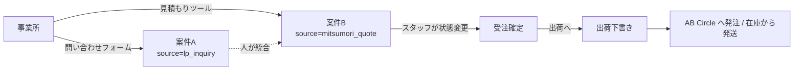
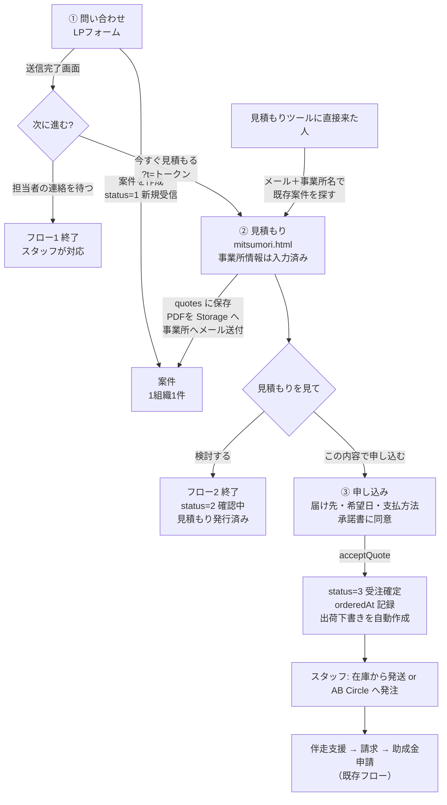
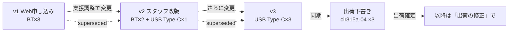

# 問い合わせ・見積もり・注文の統合 — 実装計画（2026-09-06 案）

> 対象: LP（kjk.tadakayo.jp）の問い合わせフォーム／見積もりツール（mitsumori.html）／CRM（kjk-tadakayo-admin）
> 状態: **提案・未着手**。次田さんの判断待ちの論点は §7。
> 2026-09-06 追記: **「見積もり後も、支援の調整時に内容（台数・タイプ・機種）の変更を容認する」**（次田さん決定）を反映。見積もりは"固定の契約"ではなく"版を重ねる記録"として設計する（§2.1）。

---

## 1. いま何が起きているか（現状の整理）

| 観点 | 現状 | 困ること |
|---|---|---|
| 入口 | 問い合わせ（`webhookLpInquiry`）と見積もり（`webhookMitsumori`）が**別々に案件＋事業所を新規作成**する | 同じ事業所が「問い合わせ→見積もり」と進むと**案件が2件**できる。CRMの「統合」機能で人が寄せている |
| 見積もりの記録 | 案件のフィールド（`subsidyPlan` / `cardReaders` / `totalAmount` / `selfPay`）に上書き保存。**見積書そのもの（番号・PDF・発行日）は残らない**。見積番号 `EST-…` はブラウザ側で生成し、サーバに送られるが保存されない | 「どの内容の見積もりを渡したか」が後から追えない。再発行・差し戻しができない。金額を変えると前の見積もりが消える |
| 見積もりの受け渡し | 事業所が自分でPDFをダウンロードする（印刷ダイアログ）。タダカヨには Chat 通知だけ | 事業所側でPDFを保存し忘れる。タダカヨ側に控えが無い |
| 「成約」の意味 | 見積もりツールは必須項目＋同意チェックで**自動的に**案件を作り、流入元ラベルが「見積もり成約」 | 実際は「見積もりを見た」段階で、成約ではない。ラベルが実態と合わない |
| 注文 | スタッフが CRM で状態を「3 受注確定」に手で変える。出荷は案件詳細の「出荷へ」→ `supply.html?ship={caseId}` で下書きを作る | 事業所の意思表示（「この内容で申し込む」）を受ける画面が無く、電話・メールで確認している |
| 住所 | 2026-09-06 に両フォームで郵便番号＋3カラム必須化済み | （解消済み） |

図にすると次のとおり。同じ組織が2本の線で入ってくる。



## 2. 目指す形（1組織＝1案件、3つの終わり方）

**設計の芯: 「案件」を1本にし、問い合わせ→見積もり→注文を同じ案件の上で進める。** 入口のページは今の2つ（LPフォーム／見積もりツール）を残し、URLも変えない。つなぐのは**継続トークン**（承諾書の署名依頼と同じ仕組み）。



3つの終わり方の対応:

| フロー | 事業所がすること | システムがすること | スタッフがすること |
|---|---|---|---|
| **1. 問い合わせのみ** | フォーム送信 | 案件作成（status 1）・Chat通知・自動返信メール | 2営業日以内に連絡（現状どおり） |
| **2. 問い合わせ後に見積もり** | 送信完了画面の「今すぐ見積もる」→ 構成を選ぶ | **同じ案件**に `quotes` を追加、PDFを保存し事業所へメール、status 2 へ | 見積もりの内容を CRM の「見積もり」カードで確認。必要なら再発行 |
| **3. 見積もり後に注文** | 「この内容で申し込む」→ 届け先・希望日・支払方法を確認、承諾書に同意 | status 3 受注確定、`orderedAt`、出荷下書きを自動作成、確認メール、Chat通知 | 在庫があれば出荷確定、無ければ AB Circle へ発注（既存の供給管理） |

見積もりツールに**直接**来た人（LPフォームを通らない）は今までどおり案件を作るが、**メール＋事業所名が一致する既存案件があればそこに紐づける**（新規案件を作らない）。

### 2.1 見積もり後の変更を容認する（次田さん決定・2026-09-06）

Web で申し込みを受けた後も、事前確認や支援の日程調整の中で「USBをもう1台足したい」「Bluetooth ではなく USB にしたい」「Type-A ではなく Type-C」「機種を変えたい」は普通に起きる。これを**電話で聞いてスタッフが CRM で直せる**ようにする。

- 見積もりは **版（version）** で持つ。Web で申し込んだ v1 の上に、スタッフが v2, v3 を重ねる。前の版は `superseded` にして消さない（「最初は何台で、いつ何に変わったか」が残る）
- 変えられるもの: 台数（補助対象・追加）、タイプ（BT／USB）、USB の口（Type-A／Type-C）、**機種**（商品マスタ `products` の品番から選ぶ。将来の新機種にもそのまま対応）
- 変えたら **金額はサーバで再計算**し、**出荷下書きも最新版に同期**する（下書きのうちは丸ごと作り直す。出荷確定後は既存の「出荷の修正」機能で個別に直す＝請求済・入金済は数量を触れないロックがそのまま効く）
- 変更後の見積もりPDFは**自動で事業所へメール**（件名「【変更後】お見積もり v2」）。事業所に再度「申し込む」を押させはしない（口頭合意で進める現場の運び方に合わせる。合意した経緯は `reason` とタイムラインに残す）
- どこまで戻れるか: **出荷を確定するまで**は見積もりの改版で何度でも。確定後は供給管理側の作法（出荷の修正・削除）に切り替わる



## 3. データモデルの変更

### 3.1 新設: `quotes`（見積もり）

見積もりを**独立した記録**にする。1案件に複数（v1, v2…）持てる。

```
quotes/{quoteId}
  caseId, officeId
  estNo            サーバで採番 "EST-2026-0001"（counters に quote 用を追加）
  version          同じ案件内で 1,2,3…
  plan             "houmon" | "nyusho" | "other"
  items[]          { sku:"cir415a-01"|"cir315a-02"|"cir315a-04"|…, subsidyQty, extraQty }
                   ※ 品番で持つ（"BT"/"USB" の文字列ではなく）。機種変更・新機種追加に耐えるため。
                     表示用のタイプ／つなぎ方は products マスタと product-label.js から導く
  amounts          { readers, accompanyFee, discount, totalIncl, subsidy, selfPay }  ※サーバで再計算
  pdfPath          Storage "quotes/{caseId}/{estNo}-v{version}.pdf"
  status           "issued" | "accepted" | "superseded" | "expired"
  supersedes       前の版の quoteId（改版のとき）
  reason           改版理由（"支援調整でUSB Type-Cへ変更" など・スタッフ入力）
  validUntil       発行日＋30日（§7で確定）
  createdVia       "web" | "staff"
  createdBy        スタッフ改版のとき
  createdAt, acceptedAt
```

### 3.2 `cases` に追加

```
latestQuoteId, quoteIssuedAt        見積もり一覧・絞り込み用
orderedAt, orderedVia               "web"（申し込み画面）| "staff"（CRMで手動）
```

流入元 `source` は**最初の入口**のまま変えない（分析用）。「見積もり成約」のラベルは「見積もり作成」に改める（`constants.js` の `SOURCE_LABELS`）。

### 3.3 新設: `leadTokens`（継続トークン）

問い合わせ完了→見積もり→申し込みを同じ事業所として繋ぐ鍵。承諾書の `consentRequests` と同じ作法。

```
leadTokens/{token}     token = 128bit 乱数（URLを知っている＝本人）
  caseId, officeId, email
  expiresAt            30日
  usedFor[]            ["quote", "order"]
```

ルール: `get` のみ公開・`list` 不可・書き込みは Functions のみ。トークンを持たない直接訪問者は今までどおりメール＋事業所名で照合。

### 3.4 価格ロジックの一本化

いま `PLANS` / `BT_PRICE` / `USB_PRICE` / `ACCOMPANY_FEE` は **mitsumori.html の中だけ**にある。これを `js/estimate-pricing.js`（公開側）と Functions の両方から読む共通モジュールにする。理由:

- 申し込み時に**サーバで金額を再計算**しないと、ブラウザで書き換えた金額をそのまま受注してしまう
- 将来 CRM からスタッフが見積もりを作るときに、同じ計算で出す

（供給管理の卸価格 `supply-pricing.js` は別物なので混ぜない）

## 4. 画面の変更

### 4.1 LP 問い合わせフォーム（index.html）
- 送信完了画面に2択を出す: **「担当者からの連絡を待つ」／「今すぐ見積もりを作る」**
- 「今すぐ」→ `mitsumori.html?t={token}` へ。Functions の応答に `token` を含める

### 4.2 見積もりツール（mitsumori.html）
- `?t=` があれば法人名・事業所名・担当者・連絡先・住所を**入力済みで表示**（編集は可）
- 見積もりが出た後のボタンを3つに: **PDFをダウンロード／この見積もりをメールで受け取る／この内容で申し込む**
- 「メールで受け取る」を既定で実行（PDFを Storage に保存し、`sendCaseEmail` の経路で事業所へ送る。CCで kjk-staff@ に控え）
- USB を選んだときは **Type-A / Type-C** を選ばせる（出荷の品番 `cir315a-02` / `-04` に直結するため。いま見積もりでは区別が無く、出荷時にスタッフが聞き直している）

### 4.3 申し込み画面（新規・mitsumori.html 内のステップ3）
- 見積もり内容の確認（この画面では変更不可・変えたい場合は見積もりに戻る）。**「申し込み後も、支援の日程調整の際に台数や機種の変更ができます」と明記**する（事業所が"今決めきらないと"と身構えないように）
- 届け先（事業所住所を初期値・変更可）、希望日、支払方法（前払い／伴走支援後）
- **伴走支援承諾書**への同意（既存 `consentRequests` の署名を埋め込む。§7で「ここで取る」か「従来どおり支援前に取る」かを決める）
- 「申し込む」→ Functions `acceptQuote`

### 4.4 CRM（管理画面）
- 案件詳細に**「見積もり」カード**: 発行履歴（版・日付・金額・PDF・変更理由）、再送、**「内容を変更する」**（台数・タイプ・Type-A/C・機種を products から選んで改版 → 金額再計算 → 出荷下書き同期 → 事業所へ変更後PDFをメール）。出荷が確定済みなら「供給管理で直してください」と案内して供給管理へ飛ばす
- 「スタッフが見積もりを作る」（電話で受けた相談に最初から見積もりを出す）も同じ画面（Phase 3）
- 案件一覧に「見積もり発行済み」「Web申込」の絞り込み
- 「出荷へ」ボタンは自動作成された下書きがあればそれを開く（二重作成の防止）
- 統合機能: 見積もりが両方の案件に付いていたら、統合先に `quotes` の `caseId` を書き換える

## 5. Functions の変更

| 関数 | 変更 |
|---|---|
| `webhookLpInquiry` | 応答に `token` を追加（`leadTokens` 作成）。**メール＋事業所名で既存案件があれば新規作成せず既存に activity を追加**（現在は5分以内の重複だけ弾いている） |
| `webhookMitsumori` → `createQuote` に改名 | トークンがあれば案件を特定、無ければメール＋事業所名で照合、それも無ければ新規案件。`quotes` を作成し `estNo` をサーバ採番、金額を再計算、PDFを生成して Storage へ、事業所へメール、案件を status 2 へ、Chat 通知（文言を「見積もり作成」に） |
| `acceptQuote`（新規） | トークン必須。quote を `accepted`、他の版を `superseded`。案件を status 3・`orderedAt`・`orderedVia="web"`。**出荷下書きを自動作成**（`shipments` に `status:"draft"`, `caseId`, items は品番に変換, 送付先は届け先）。確認メールを事業所へ、Chat 通知。承諾書を取る設計なら `consentRequests` も作成 |
| `reviseQuote`（新規・callable・スタッフ） | 最新版を `superseded` にして新しい版を作る。金額を再計算、PDF 生成、**出荷下書きが `draft` なら items/送付先を最新版で作り直す**（確定済みなら触らず警告を返す）、事業所へ「変更後」PDF をメール、案件の `latestQuoteId` 更新、タイムラインに理由を記録 |
| `sendQuoteMail`（新規・callable） | CRM から見積もりPDFを再送 |

PDF 生成はどこでやるか: 受信側の見積もりページで html2pdf → base64 → Functions（領収書メールと同じ経路）が最も早い。サーバで Puppeteer を持つより軽い。

## 6. 進め方（3段階）

| Phase | 内容 | 目安 | 出せる価値 |
|---|---|---|---|
| **1. 案件を1本にする** | `leadTokens`／完了画面の2択／見積もりの事前入力／既存案件への紐づけ／`quotes` 新設と `estNo` 採番／PDFの保存とメール送付／CRM 見積もりカード（閲覧・再送）／ラベル「見積もり作成」 | 2〜3日 | 案件の二重登録が消える。見積もりの控えが残る。事業所がPDFを取り逃さない |
| **2. Web で申し込みを受ける＋スタッフが改版できる** | 申し込みステップ／`acceptQuote`／出荷下書きの自動作成／確認メール／USB の Type 選択／サーバでの金額再計算（価格モジュール共通化）／**CRM「内容を変更する」＝`reviseQuote`（台数・タイプ・機種の改版と出荷下書き同期）**／CRM 絞り込み | 4〜5日 | 電話・メールでの「この内容でいいですか」が不要になる。受注が自動で供給管理に流れる。**支援調整での変更が CRM で完結し、変更後の見積書も自動で届く** |
| **3. スタッフ側の新規見積もり作成ほか** | CRM から最初の見積もりを作る（電話相談向け）／有効期限／GA4 のステップ別イベント／統合時の `quotes` 追従 | 2日 | 電話で受けた相談にもその場で見積もりを出せる。どの段階で離脱するかが見える |

（改版機能は当初 Phase 3 に置いていたが、「見積もり後の変更を容認する」方針により**Phase 2 の中核**へ繰り上げた。品番ベースの `items[]` は Phase 1 の `quotes` 新設時点から採用する＝後で作り直さない）

各 Phase とも: preview チャンネルで確認 → Codex review → 本番。Functions は列挙デプロイ（`--only "functions:a,functions:b"`）。

**Phase 1 だけでも独立して価値がある**ので、まず Phase 1 を出して運用に乗せ、Phase 2 の申し込み画面の文言・承諾書の扱いを現場と詰めるのが安全。

## 7. 決めていただきたいこと

1. **承諾書を「申し込み時」に取るか**: いまは伴走支援の前に別途署名依頼。申し込み画面に組み込むと1回で済むが、「まだ支援内容の説明を受けていないのに承諾書に同意させる」形になる。→ 私の案: **申し込み時は「見積もり内容と支払条件への同意」だけ**にし、承諾書は従来どおり事前確認のカードから（条文が"支援の進め方"を含むため）
2. **見積もりの有効期限**: 30日を仮置き。助成金の申請期限（2027-03-12）を跨ぐ見積もりは注意書きを出す
3. **支払方法の選択を申し込み時に取るか**: LPに「伴走支援後か前払いか選べる」と書いてあるので、選ばせるのが自然。→ 取る案
4. **USB の Type-A / Type-C を見積もり段階で選ばせるか**: 出荷の品番に直結するので**選ばせる案**（分からない人向けに「PCの差込口の写真」で選ぶUIを添える）。**決めきれなくても後から変えられる**（§2.1）ので、迷う人には「あとで変更できます」と出す
8. **スタッフが改版したとき、事業所に再度「申し込む」を押してもらうか**: → 私の案は**押させない**（口頭合意で進め、変更後PDFを自動メール・理由をタイムラインに残す）。金額が増える改版だけ、メール本文に「差額 ¥X」を明記する
5. **「見積もり成約」のラベル変更**: 過去データの `source` 値は変えず、表示ラベルだけ「見積もり作成」に
6. **直送（AB Circle → 事業所）か在庫発送かの判断**: 自動化せずスタッフ判断のまま（在庫数・地域で変わるため）
7. **既存2ページを残すか、1ページに統合するか**: **残す案**（URLが印刷物・チラシ・動画に載っているため）。見た目は同じでも裏で1案件に繋ぐ

## 7.5 決定済み（蒸し返さない）

- **見積もり後の内容変更を容認する**（2026-09-06 次田さん）: 台数の増減・BT/USB の変更・Type-A/C の変更・機種の変更を、支援の調整時にスタッフが CRM で行える。見積もりは版で積み、出荷確定までは改版で対応。確定後は供給管理の「出荷の修正」へ

## 8. 手を付けないこと（今回の範囲外）

- AB Circle への発注の自動化（在庫・直送判断が絡むためスタッフ判断を維持）
- 請求・入金・領収書（既存フローそのまま。受注確定以降は変えない）
- 認定事業所ポータル（partner.html）の受注フロー（別系統）
