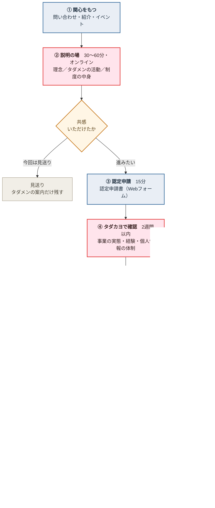

# 認定事業者制度 — 認定までのプロセスと、取り交わす書類の検討（2026-09-06 案）

> 出典: 2026-09-05 「介護情報基盤 認定事業者・新タダメン運用相談MTG」議事録（藤田さん・次田さん・蜂須賀さん）
> 状態: **検討案・未承認**。書類のサンプル（実文面）は次段階で作る。まず「流れ」と「何を・どの形式で取り交わすか」を固める。

---

## 0. この検討の前提（議事録の決定事項から）

| # | 決まっていること | 書類・プロセスへの影響 |
|---|---|---|
| 1 | スタッフ全員を一律にタダメンにしない | 「タダメン」と「認定事業者の実務担当者」を**別の書類**で扱う |
| 2 | 代表者または主担当者1名以上はタダメン加入 | 認定申請書に**タダメン加入者を記名**する欄が要る |
| 3 | その他の実務担当者はゲストアカウント | ゲスト用の**アカウント利用の同意**が別に要る（1年更新） |
| 4 | 理念の説明 → 共感 → 加入 → 認定手続き、の順序 | 申請より前に**説明を受けたことの確認**を挟む |
| 5 | 自社案件は自社対応、タダカヨ案件はタダメンとして対応（案件ごとに選べる） | 「認定事業者としての約束」と「業務委託の条件」を**分ける** |
| 6 | 自社対応分も**支援実績件数は報告**してもらう | 誓約事項に報告義務を明記＋報告の様式が要る |
| 7 | 2026年度はプロトタイプ運用・積極募集はしない | 書類に**有効期間（〜2027年3月末）と見直し前提**を書いておく |

---

## 1. 認定までのプロセス（案・7ステップ）

**誰が動くか**を色で分けています。■ タダカヨ　■ 事業者　■ 双方　◆ 分かれ道

**この順序にする理由**: ②の説明を③の申請より前に置くことで、「認定されるために形式的にタダメンになる」流れを避ける（2026-09-05 MTG の決定）。共感いただけなければ、認定には進まずタダメンの案内だけ残す。

**各ステップの中身**

| ステップ | 誰が | やること | 目安 |
|---|---|---|---|
| ① 関心表明 | 事業者 | 問い合わせ・イベントでの相談 | — |
| ② 説明の場 | タダカヨ（藤田さん想定） | ①タダカヨとはどんな法人か ②「お金をかけずにより良い介護へ」の考え方 ③タダメンの活動 ④認定事業者制度の中身（できること・約束すること） | 30〜60分・オンライン |
| ③ 認定申請 | 事業者 | 申請書を提出（法人情報・体制・担当者・タダメン加入予定者・対応可能地域） | 15分 |
| ④ 確認 | タダカヨ | 事業実態・介護分野での経験・反社会的勢力でないこと・個人情報の取扱い体制を確認 | 2週間以内 |
| ⑤ 書類 | 双方 | 誓約書兼同意書に電子署名（詳細は§2） | 即日 |
| ⑥ 体制づくり | タダカヨ | 認定番号付与・アカウント発行・Chatスペース開設・CRM の `partners` 登録 | 3営業日 |
| ⑦ 公開 | 双方 | LP掲載用の情報提供 → 掲載・認定証交付 | 1週間 |
| 更新 | 双方 | 年1回・実績件数の報告と継続意思の確認 | 年度末 |

> ②と③の順序が肝。**「認定事業者になるために形式的にタダメンになる」を避ける**という議事録の趣旨を、プロセスの形で担保する。

---

## 2. 取り交わす書類（案・4点＋2点）

**基本の考え方: 「約束ごと」は1本にまとめ、「お金の話」は必要な事業者とだけ別に結ぶ。**
書類が多いと運用が回らないので、必須は太字の3点に絞る。

| # | 書類 | 誰と | 必須 | 形式（推奨） | 中身 |
|---|---|---|---|---|---|
| 1 | **認定申請書** | 事業者 → タダカヨ | ● | **Webフォーム**（回答は自動でCRMへ） | 法人情報・代表者・主担当者・実務担当者の人数・対応可能地域・介護分野の経験・反社会的勢力の排除の表明・個人情報の取扱い体制 |
| 2 | **認定事業者 誓約書兼同意書** | 双方 | ● | **オンライン署名**（承諾書と同じ仕組み） | 制度の目的・できること・遵守事項・実績報告・個人情報・ロゴ使用・有効期間・解除 → §3 |
| 3 | **認定証** | タダカヨ → 事業者 | ● | **PDF**（A4・認定番号・有効期限入り） | 掲示・名刺・自社サイトに使える証 |
| 4 | アカウント利用の同意 | 実務担当者ごと | ○ | **Webフォーム**（ゲストアカウント発行時） | 貸与ではなく個人単位／退職・異動時の連絡／1年更新／禁止事項 |
| 5 | 業務委託基本契約（覚書） | タダカヨが案件を依頼する事業者のみ | △ | 電子契約 | 委託内容・報酬・交通費・請求と支払い・再委託・秘密保持 |
| 6 | 個人情報の取扱いに関する覚書 | タダカヨから利用者情報を渡す場合のみ | △ | 電子契約 | 取扱いの範囲・再委託の可否・事故時の連絡・返却／消去 |

**5・6が「必要な事業者とだけ」な理由**: 議事録の整理では、認定事業者は原則**自社で獲得した案件を自社事業として**行う。この場合タダカヨは業務を委託しておらず、個人情報も渡さないため、契約は不要。タダカヨ案件を回すときだけ 5 を、利用者情報を預けるときだけ 6 を結ぶ。

---

## 3. 誓約書兼同意書に入れる条項（案）

1. **目的** — 介護情報基盤の導入支援を各地域で担い、現場の負担を減らすこと
2. **認定事業者ができること** — 「タダカヨ認定事業者」の名称・ロゴの使用／認定事業者価格でのカードリーダー仕入れ／認定事業者ポータルの利用／専用Chatスペースでの相談／LPへの掲載
3. **遵守事項**
   - 事業所に対して、タダカヨの理念に反する売り方をしない（不要な機器の抱き合わせ・助成金額を超える請求など）
   - 助成金の申請を代行する場合、事実と異なる書類を作らない
   - 支援の品質を保つ（タダカヨが用意するガイドブック・手順に沿う）
   - 利用者の個人情報を、支援に必要な範囲を超えて取得・保存しない
4. **実績報告** — 自社で対応した支援について、**支援した事業所数を四半期ごと（または年1回）に報告**する。案件の詳細（事業所名・金額）は求めない
5. **名称とロゴの使用** — 認定期間中に限る／認定番号を併記／タダカヨの事業であるかのような表示はしない／認定終了後は速やかに削除
6. **個人情報** — 各自が自社の責任で取り扱う。タダカヨから預かった情報がある場合は §2-6 の覚書による
7. **有効期間** — **1年（2026年度はプロトタイプのため 2027年3月31日まで）**。双方から申し出がなければ更新
8. **認定の解除** — 遵守事項に反したとき／事業を停止したとき／申し出があったとき。解除後はロゴ・掲載を取り下げる
9. **この制度が試行であること** — 2026年度は運用しながら条件を見直すこと、変更時は事前に知らせること

> **4の「件数だけ」がポイント。** 詳細まで求めると相手の事業に踏み込みすぎるし、タダカヨ側も管理しきれない。普及状況の把握・広報・成果検証には件数で足りる（議事録 §7 の整理どおり）。

---

## 4. 形式の推奨と、その理由

### 4-1. 紙ではなく電子で

| 観点 | 電子（推奨） | 紙 |
|---|---|---|
| 手間 | その場で完了・郵送往復なし | 印刷・押印・郵送で1〜2週間 |
| 収入印紙 | **不要**（電子データは課税文書にあたらないとするのが実務の扱い） | 業務委託の基本契約は課税対象になり得る |
| 保管 | 検索できる・紛失しない | 保管場所と管理台帳が要る |
| 相手の負担 | スマホでも署名できる | 代表印を押す手配が要る |

**§2-5 の業務委託契約を紙で結ぶと収入印紙が要る場合がある**（継続的取引の基本契約に該当するとき）。電子ならこの論点自体が消えるため、全書類を電子で統一するのが合理的。

### 4-2. 署名の方法は、いま動いている仕組みを使い回す

CRM には**伴走支援承諾書のオンライン署名**（`consentRequests`）が既にあり、次の性質を満たしている。

- URL を知っている人だけが開ける（推測不能なトークン）
- 署名時刻はサーバの時刻を使う（端末の時計を信用しない）
- 署名済みは書き換えられない
- 条文の全文をその時点のまま保存する（あとで条文を変えても、署名済みの内容は変わらない）

**認定事業者の誓約書兼同意書も、同じ仕組みに載せるのが最短で確実。** 新しく電子契約サービスを契約する必要がない。

> ただし、承諾書は「事業所 → タダカヨ」の一方向の同意。誓約書は双方の約束なので、**タダカヨ側の署名（常務理事名）を条文に固定で入れる**形にすれば、同じ仕組みのまま成立する。

### 4-3. 書類ごとの形式まとめ

| 書類 | 形式 | 実装 |
|---|---|---|
| 認定申請書 | Webフォーム | LP に `partner-apply.html` を新設（問い合わせフォームと同じ作りで、CRMに `partnerApplications` として入る） |
| 誓約書兼同意書 | オンライン署名 | `consentRequests` と同じ方式（コレクションは分ける） |
| 認定証 | PDF（A4・横） | CRM から発行。認定番号・法人名・有効期限・常務理事名・ロゴ |
| アカウント利用の同意 | Webフォーム | ゲストアカウント発行の申請と同時に取る |
| 業務委託基本契約・個人情報の覚書 | PDF＋電子署名 | 該当する事業者だけ。当面は個別対応でよい |

---

## 5. システム側でやること（Phase 1 の続きに置く）

| 項目 | 内容 | 優先 |
|---|---|---|
| 認定申請フォーム | `partner-apply.html` ＋ `webhookPartnerApply`。CRM に一覧を作る | 中 |
| 誓約書の署名 | `partnerAgreements`（`consentRequests` の作りを流用）。条文は版で凍結 | 中 |
| 認定証PDF | CRM の認定事業者画面から発行（`supply-print.html` の作りを流用） | 低 |
| 実績報告 | 認定事業者ポータル（`partner.html`）に「支援件数の報告」を追加。四半期ごとに件数だけ | 中 |
| 認定番号 | `partners` に `certNo`（例 `TDK-KJK-003`）・`certifiedAt`・`certExpiresAt`・`status` を追加。LPの `#00X` 表示と揃える | 中 |
| ゲストアカウント | Google Workspace 側の話。**まず「ゲストで CRM・Chat が使えるか」の技術検証が先**（議事録 ToDo） | 高 |

> **現状**: LP には #001〜#003 を手書きで載せている（2026-09-06 追加）。認定番号を `partners` に持たせたら、LP側も同じ番号を出す。

---

## 6. 次に決めていただきたいこと

1. **説明の場（②）は誰が担当するか** — 議事録では藤田さん中心の流れ。標準の説明資料（スライド）を作るか
2. **誓約書のタダカヨ側の署名者** — 常務理事（次田さん）でよいか
3. **実績報告の頻度** — 四半期ごとか年1回か（私の案: **年2回**。四半期は相手の負担が大きく、年1回だと広報のタイミングを逃す）
4. **認定番号の付け方** — `#001` のような通し番号でよいか（`TDK-KJK-001` のような形にするか）
5. **有効期間** — 2026年度は一律 2027-03-31 までで揃えるか、認定日から1年か（**揃える案**を推奨。更新作業がまとまる）
6. **ロゴ** — 「タダカヨ認定事業者」のバッジ画像を作るか（名刺・自社サイト用。作るなら別途デザイン）

承認をいただけたら、**§2 の 1〜3（申請書・誓約書兼同意書・認定証）のサンプル文面**を作ります。
